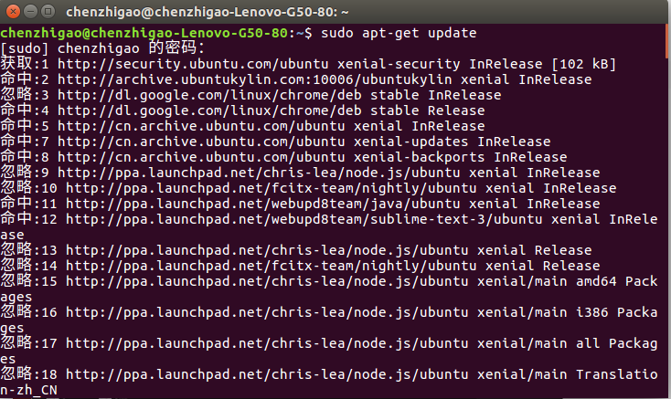
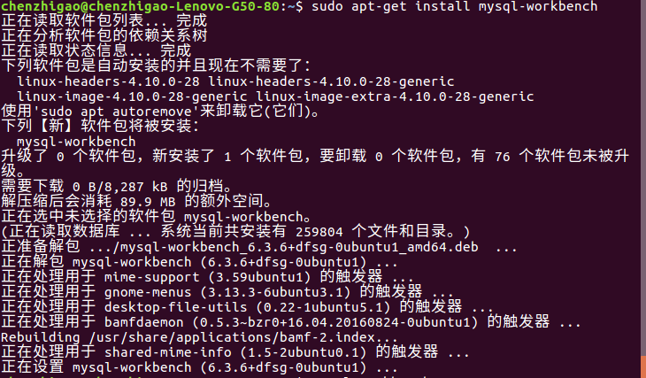
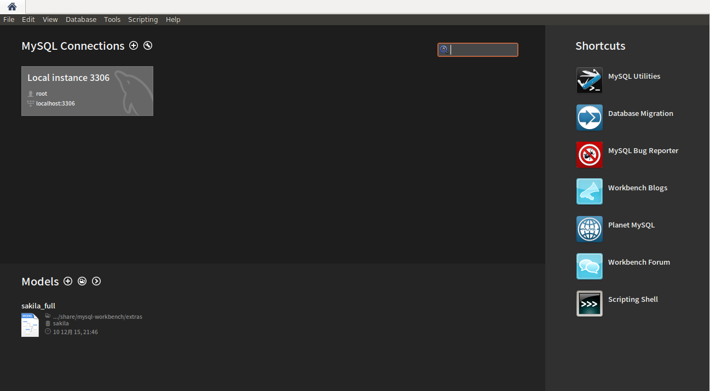
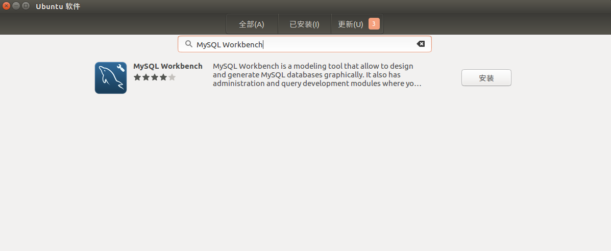
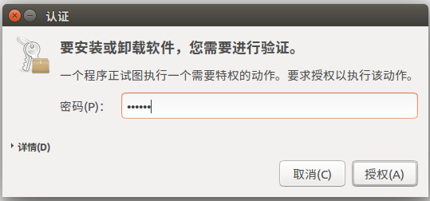

#第三节 MySQL Workbench

我们在项目中用的数据库工具是MySQL Workbench。
 
**这里我们介绍两种安装方式：**

## 命令安装

1.更新系统软件源：

`sudo apt-get update`

 

2.使用以下命令安装MySQL Workbench：

`sudo apt-get install mysql-workbench`

 

3.命令行输入命令：`mysql-workbench`

这时会跳出MySQL Workbench登录页面

 

这时你已经成功完成本节安装MySQL Workbench的任务。

下面是简单使用介绍可参考：[百度经验](https://jingyan.baidu.com/album/3f16e003c2da162591c103e4.html?picindex=1)

##MySQL Workbench软件商店安装

1.打开软件商店，搜索MySQL Workbench：

 

2.点击安装，会跳出认证框，输入用户密码并验证：

 

在菜单栏中会显示下载进度当下载成功后，会跳出如下页面：

 

以上是workbench的安装，我们在之后的教程中会更详细地讲它的用法。

作者：陈志高
