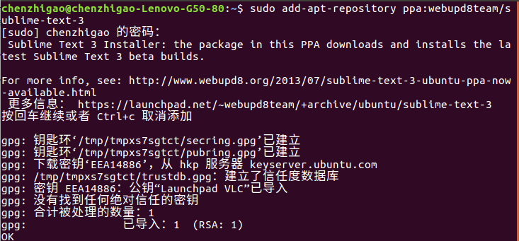
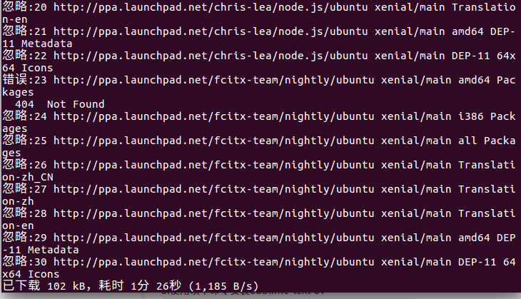
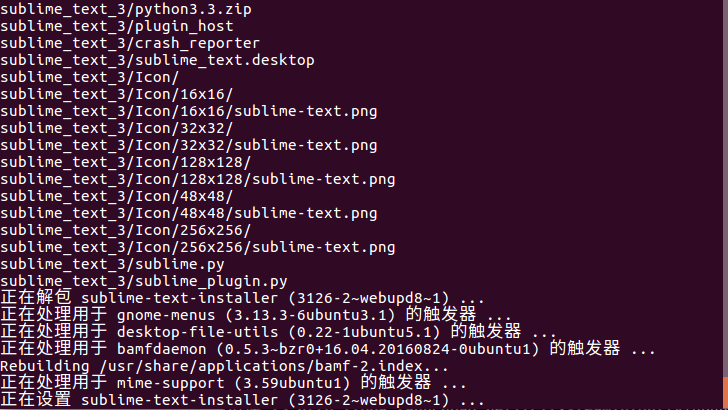
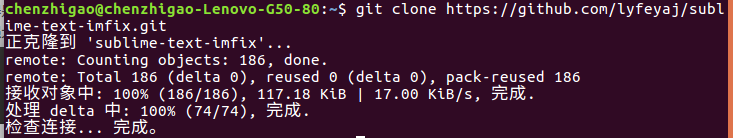
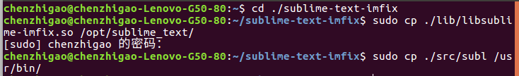
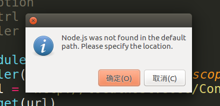
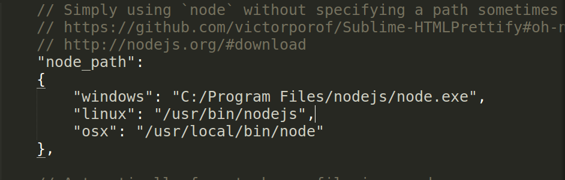
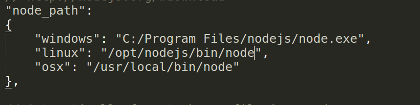

# 第八节 Sublime
本教程中使用的代码编辑器是`sublime`，你会喜欢上它不只是因为它漂亮的主题，还有其强大的功能，最主要的是它是免费的。废话少说，开始安装吧！
## 安装

### 命令安装
1.添加Sublime-text-3软件包的软件源：

`sudo add-apt-repository ppa:webupd8team/sublime-text-3`

2.使用以下命令更新系统软件源：

`sudo apt-get update`

3.使用以下命令安装Sublime-text-3：

`sudo apt-get install sublime-text-installer`

4.打开终端输入：`subl`

会跳出你下载的sublime，此时证明你安装成功。

### 解决ubuntu下sublime无法输入中文的问题:

安装成功后你并不能应用拼音输入法，这里介绍一种较为简单的方法。

1.下载我们需要的文件，打开终端，输入：

`git clone https://github.com/lyfeyaj/sublime-text-imfix.git`

2.将subl移动到/usr/bin/，并且将sublime-imfix.so移动到/opt/sublime_text/（sublime的安装目录）:

依次输入以下命令

- `cd ./sublime-text-imfix`
- `sudo cp ./lib/libsublime-imfix.so /opt/sublime_text/`
- `sudo cp ./src/subl /usr/bin/`

3.用subl命令试试能不能启动sublime，如果成功启动的话，应该就可以输入中文了。

注意:如果你的sublime处于启动状态需要重启。

### sublime中常用的插件
**安装插件前，需要首先安装package control**

- Package Control 包管理器（必装）
- BrackeHighlighter 高亮显示
- Color Highlighter 高亮显示
- DocBlockr 写注释
- Emmet html 必备神器
- Html-CSS-JS Prettify 美化代码
- SideBarEnhancements 增强左侧菜单

安装可参考 [百度经验](https://jingyan.baidu.com/album/4d58d541caeeaa9dd4e9c093.html?picindex=1)

___

### 常见问题
1.使用Html-CSS-JS Prettify插件格式式化代码时出错：

点击确定，它提示代码格式化需要依赖node，但找不到node，这时你就要找到你的node安装的路径。

你在装nodejs的时候装到了/opt/nodejs/bin/node下，但sublime默认的是/usr/bin/nodejs：

把它改为你的node对应的路径就可以了

这样问题就解决了。

___

*作者：陈志高*
