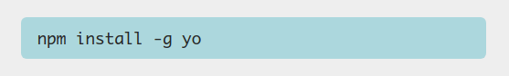
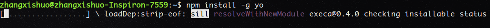
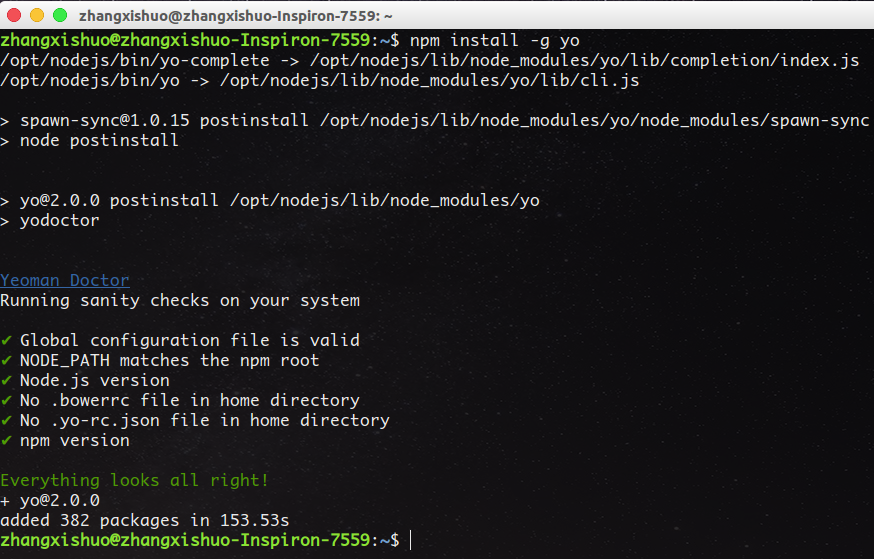
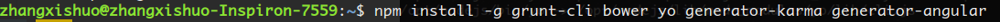
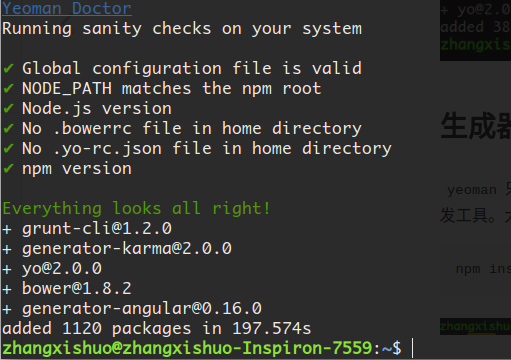
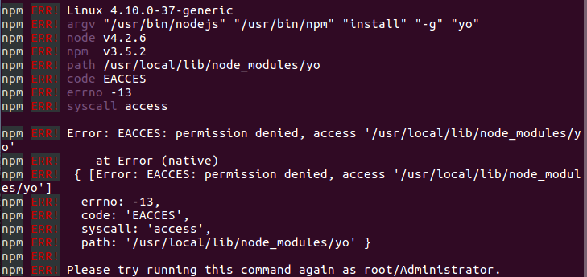

# 第一节 yeoman

`yeoman`是一款开源项目，其目标是通过`Grunt`和`Bower`的包装为开发者创建一个易用的工作流。属于一款前台开发利器。

## 安装

我们打开`yeoman`的官方网站，[yeoman](http://yeoman.io/)



打开官网我们就看到这样一条醒目的命令，这就是安装`yeoman`的命令。

```
npm install -g yo
```



看到终端中出现一条绿色提示：`Everything looks all right!`，OK！



## 生成器

`yeoman`只是一个基础工具，我们使用`AngularJS`来开发前台，所以需要安装一系列针对`AngularJS`的开发工具。大牛们已经帮我们整理好了，[链接](https://github.com/yeoman/generator-angular)

```
npm install -g grunt-cli bower yo generator-karma generator-angular
```



同样是`Everything looks all right!`，安装成功！



## 注意

如果出现类似如下错误，可能是由于`nodejs`以`root`权限安装所致。



将上述命令加上`sudo`。

```
sudo npm install -g yo
sudo npm install -g grunt-cli bower yo generator-karma generator-angular
```

*作者：张喜硕*