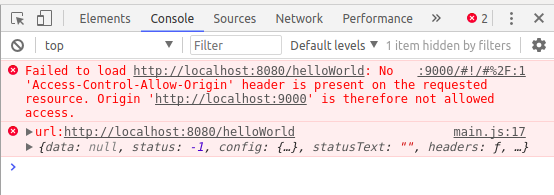
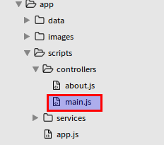
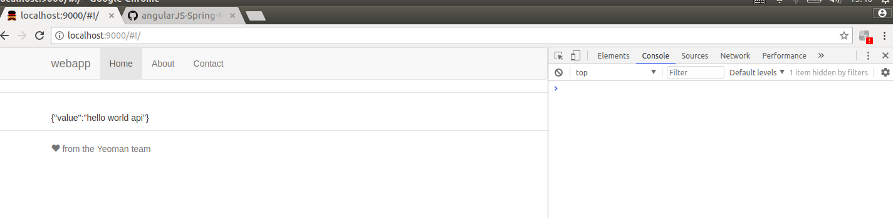

# 前后台跨域连接
上节我们完成了后台代码的编写，这节我们将实现把后台的数据传到前台并显示。

## 前后台对接

### 更改路由

1.打开sublime编辑器，把前台控制器controllers中main.js的代码修改一下

``` js
angular.module('testApp')
  .controller('MainCtrl', function($scope, $http) {
    var url = 'http://localhost:8080/helloWorld';
    $http.get(url)
      .then(function success(response) {
        $scope.data = response.data;
      }, function error(response) {
        console.error('url:' + url, response);
      });
  });
```

**根本性的变化如下**：

请求前台的模拟数据，对应的路由为：

``` js
var url = 'http://localhost:9000/data/helloWorld.txt';
```

如果我们想要请求后台的数据，那么就要对路由进行一下改写如下：

```js
var url = 'http://localhost:8080/helloWorld';
```

2.更改后的结果

改完之后运行一下后台，则会在浏览器控制台中报如下的错误：



下面我们将通过对后台进行相应的配置来实现跨域。

___

### 后台实现跨域

1.后台代码改动

我们对com.mengyunzhi下的Application文件的内容进行一下修改，一开始内容如下：

```java
package com.mengyunzhi;

import org.springframework.boot.SpringApplication;
import org.springframework.boot.autoconfigure.SpringBootApplication;

@SpringBootApplication
public class Application {
    public static void main(String[] args) {
        SpringApplication.run(Application.class, args);
    }
}
```

修改后内容如下：

```java
package com.mengyunzhi;

import org.springframework.boot.SpringApplication;
import org.springframework.boot.autoconfigure.SpringBootApplication;
import org.springframework.context.annotation.Bean;
import org.springframework.web.servlet.config.annotation.CorsRegistry;
import org.springframework.web.servlet.config.annotation.WebMvcConfigurer;
import org.springframework.web.servlet.config.annotation.WebMvcConfigurerAdapter;

@SpringBootApplication
public class Application {
    public static void main(String[] args) {
        SpringApplication.run(Application.class, args);
    }

    @Bean
    public WebMvcConfigurer corsConfigurer() {
        return new WebMvcConfigurerAdapter() {
            @Override
            public void addCorsMappings(CorsRegistry registry) {
                registry.addMapping("/**").allowedOrigins("http://localhost:9000");
            }
        };
    }
}
```

注意 ：这里我们只用了一个控制器，/** 和 /helloWorld效果相同，当我们有很多控制器要写的时候，用/** 来简化我们的操作过程。

2.修改后结果显示
再次重启一下后台，再次查看控制台，控制台不会报错，实现了前后台连接。



打开浏览器查看浏览器的控制台：



详细内容请参考[官方文档](http://spring.io/guides/gs/rest-service-cors/) 

## 跨域
简单的了解一下跨域：

### 什么是跨域

1.同源

与跨域相对的便是同源，什么是同源呢？
**同源**出于保护用户信息安全的目的，现在的浏览器都会实施“同源策略”这个政策，所谓“同源策略”指的是不同源的客户端脚本在没有明确授权情况下，不允许读写对方的资源。

>举个例子，你家的小孩带了他的朋友来你们的家里玩，你家的小孩如果要在自家屋里拿玩具玩、拿东西吃你自然是不会阻止，但是如果你家小孩的朋友人品不行，乱拿东西吃、乱翻你家的东西，你自然不允许。

2.跨域

同源策略限制了来自一个域的站点向另一个域请求数据,而跨域资源共享策略解放了同源策略,它允许JavaScript在一个页面上使用不同来源的REST API服务。


>但如果这个小孩经常来你家玩，这个小孩很听话也很招人喜欢，这时候什么玩的和吃的他就可以随便拿了，这就实现了所谓的跨域。

___
### 跨域的特征

同源的特征：
- 同协议：如都是http或https
- 同域名：主机名/子域名或者IP地址
如都是``` terenyeung.applinzi.com/newapp/carousel.html ```和```terenyeung.applinzi.com/index.html```
这里的 ```terenyeung.applinzi.com```是域名。
- 同端口：如都是80端口
跨域：
只要不满足同源特征的三点之一的就是跨域。

详细内容可参考
[阮一峰的网络日志](http://www.ruanyifeng.com/blog/2016/04/cors.html) 

___

*作者：陈志高*

