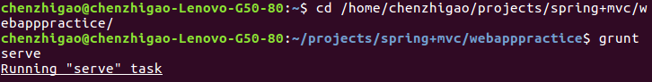
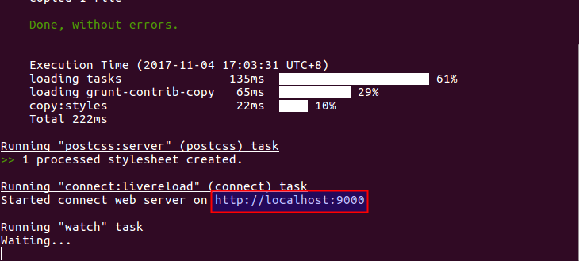
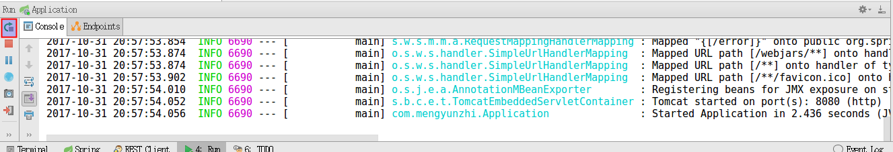
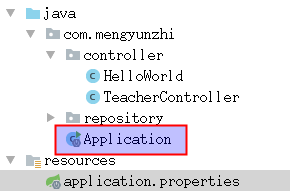

# 前后台跨域连接
上节我们完成了后台代码的编写，这节我们将实现把后台的数据传到前台并显示。
本节我们的重点是跨域,讲完跨域再讲前后台连接。


## 前后台对接


### 更改路由

1.首先我们要把前台控制器```controllers```下```main.js```的代码修改一下


打开sublime编辑器，把前台控制器controllers中main.js的代码修改一下

``` js

angular.module('testApp')
  .controller('MainCtrl', function($scope, $http) {
    var url = 'http://localhost:8080/helloWorld';
    $http.get(url)
      .then(function success(response) {
        $scope.data = response.data;
      }, function error(response) {
        console.error('url:' + url, response);
      });
  });
```

变化如下：
请求前台的模拟数据，对应的路由为：


``` js
var url = 'http://localhost:9000/data/helloWorld.txt';
```

如果我们想要请求后台的数据，那么就要对路由进行改写如下：

```javascript
var url = 'http://localhost:8080/helloWorld';
```


2.更改后的结果

我们依次启动后前台，并打开浏览器的控制台，将会得到如下图的一个错误：

启动前台：






重启后台：



浏览器控制台报错：


产生这个错误的原因是：浏览器不允许跨域访问。下面，我们共同来解决这个问题。
下面我们将通过对后台进行相应的配置来实现跨域。

___

### 实现跨域


1.后台代码改动




我们对```com.mengyunzhi```下的```Application```文件的内容进行一下修改，开始内容如下：

```java
package com.mengyunzhi;

import org.springframework.boot.SpringApplication;
import org.springframework.boot.autoconfigure.SpringBootApplication;

@SpringBootApplication
public class Application {
    public static void main(String[] args) {
        SpringApplication.run(Application.class, args);
    }
}
```

修改后内容如下：

```java
package com.mengyunzhi;

import org.springframework.boot.SpringApplication;
import org.springframework.boot.autoconfigure.SpringBootApplication;
import org.springframework.context.annotation.Bean;
import org.springframework.web.servlet.config.annotation.CorsRegistry;
import org.springframework.web.servlet.config.annotation.WebMvcConfigurer;
import org.springframework.web.servlet.config.annotation.WebMvcConfigurerAdapter;

@SpringBootApplication
public class Application {
    public static void main(String[] args) {
        SpringApplication.run(Application.class, args);
    }

    @Bean
    public WebMvcConfigurer corsConfigurer() {
        return new WebMvcConfigurerAdapter() {
            @Override
            public void addCorsMappings(CorsRegistry registry) {
            	// 允许跨域请求
                registry.addMapping("/helloWorld").allowedOrigins("http://localhost:9000");
            }
        };
    }
}
```

注意 ：  
 ```registry.addMapping("/helloWorld").allowedOrigins("http://localhost:9000");``` 中"/helloWorld"要保证和后台和前台控制器的路由相同。

2.修改后结果显示

再次重启一下后台，打开浏览器查看浏览器的控制台,控制台不会报错，实现了前后台连接。


详细内容请参考[官方文档](http://spring.io/guides/gs/rest-service-cors/) 

获取本节代码输入命令```git checkout -f  2.10-api-cors-artifactId```

## 跨域

### 什么是跨域

跨域 = 不同源,学习跨域以前，我们先学习下什么是同源。

- 同源
同源出于保护用户信息安全的目的，现在的浏览器都会实施“同源策略”这个政策，所谓“同源策略”指的是不同源的客户端脚本在没有明确授权情况下，不允许读写对方的资源。

<p><strong>举个例子，你家的小孩带了他的朋友来你们的家里玩，你家的小孩如果要在自家屋里拿玩具玩、拿东西吃你自然是不会阻止，但是如果你家小孩的朋友人品不行，乱拿东西吃、乱翻你家的东西，你自然不允许。</strong></p>

- 跨域
同源策略限制了来自一个域的站点向另一个域请求数据,而跨域资源共享策略解放了同源策略,它允许JavaScript在一个页面上使用不同来源的REST API服务。

<p><strong>但如果这个小孩经常来你家玩，这个小孩很听话也很招人喜欢，这时候什么玩的和吃的他就可以随便拿了，这就实现了所谓的跨域。</strong></p>


### 跨域的特征

同源的特征：

- 同协议：如都是http或https
- 同域名：主机名/子域名或者IP地址
如都是``` www.mengyunzhi.com/newapp/carousel.html ```和```www.mengyunzhi.com/index.html```
这里的 ```www.mengyunzhi.com```是域名。
- 同端口：如都是80端口
跨域：
只要不满足同源特征的三点之一的就是跨域。

详细内容可参考
[阮一峰的网络日志](http://www.ruanyifeng.com/blog/2016/04/cors.html) 


*作者：陈志高*

