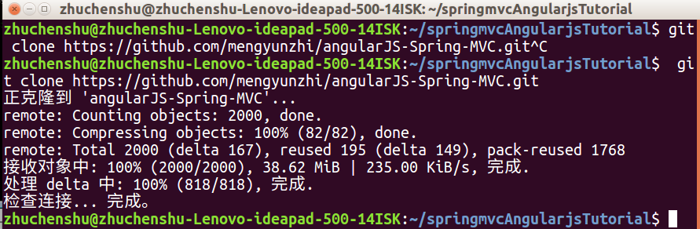
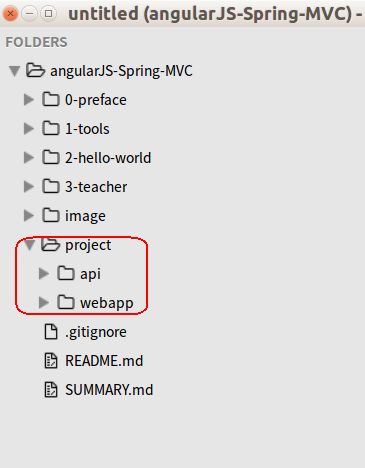

##  第二节 yeoman环境的运行

接着上一节在文件夹下新建一个文件夹webapp,然后进入webapp文件夹。在webapp文件夹中,执行下面的命令

`yo angular test`

根据下图选择，按空格键选中js文件,回车继续

 

这个过程可能时间比较长，耐心等候，出现下图代表完成，直接ctrl+c结束。

 

完成后执行下面的命令启动项目

`grunt serve`

启动项目自动打开浏览器如下图所示

 

执行`grunt`命令是自动检查代码，会发现下面的报错，原因karma 用于测试，但我们还没有安装。

 

所以我们要在webapp目录下的Gruntfile.js文件下将查找karma并注释

 
 

最后，再执行grunt检查错误，以及使用grunt serve来启动项目。项目成功启动后，说明yoman 环境搭建成功。

 


参考官方教程:[https://github.com/yeoman/generator-angular#readme](https://github.com/yeoman/generator-angular#readme) 

#### 使用git查看本教程示例代码

---

在第一章第四节我们已经教大家装好了`git`，现在我们要用`git`把教程中的项目代码复制一份到本地，执行以下命令

` git clone https://github.com/mengyunzhi/angularJS-Spring-MVC.git`

这里需要等待几分钟，网速不同的情况下，需要等待的时间也不相同。`Clone`成功后如下图所示：

 

此时你会发现当前文件夹下面多了一个名为`angularJS-Spring-MVC`的文件夹，这个文件目录如下图所示，在`project/api`下存放后台`springmvc`的项目示例代码，在`project/webapp`下存放着前台`angularjs`的项目示例代码,我们可以通过`sublime`打开相应文件查看相应的示例代码。

 

接着在命令行中输入下面几条命令，每条命令输入后需回车执行，执行完成后，再输入下一条命令。

```
cd angularJS-Spring-MVC/                   // 切换到angularJS-Spring-MVC文件下
git checkout -f 2.2                        // 将本地代码切换成本节的示例代码
```

> 1.以后我们在教程中只给出第二条命令，比如：`git checkout -f 2.2`
> 2.我们在使用教程中给出的命令前，需要先执行命令切换到angularJS-Spring-MVC文件夹下

我们的代码仓库一直在不断的完善中，如果你按教程中的命令执行git checkout -f xxx发生错误时，可以尝试。

```
git pull
git fetch --tags
```

GIT没什么技术含量，我们经常使用，自然而然的也就掌握了。

---

作者：朱晨澍