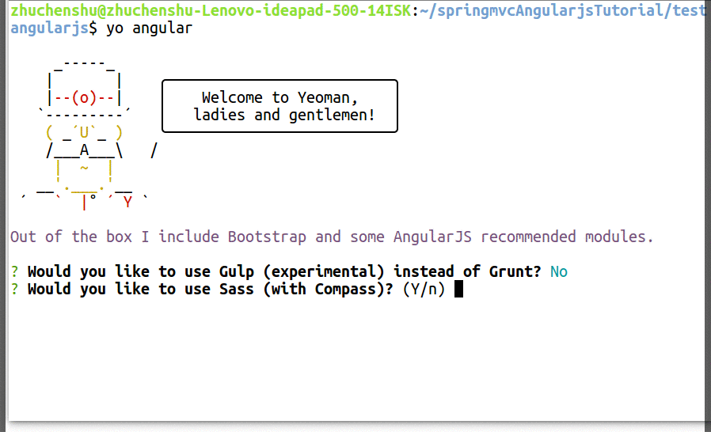
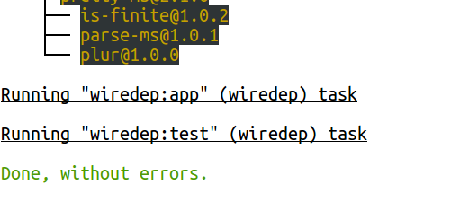
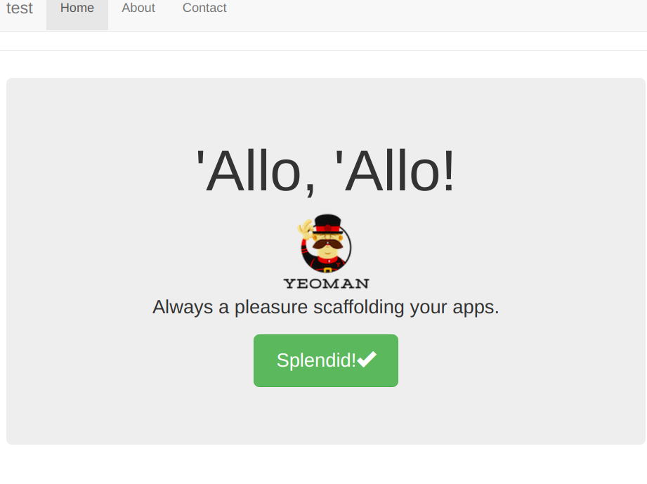
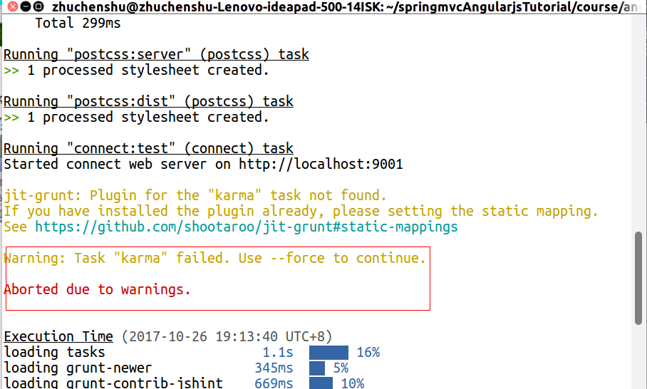
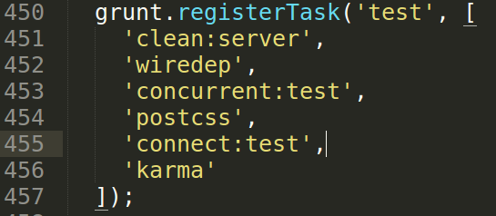
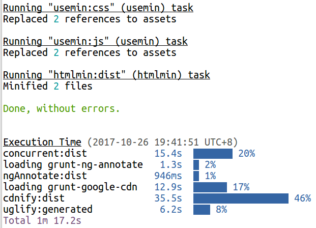

##  第二节 yeoman环境的运行

接着上一节在文件夹下新建一个文件夹webapp,然后进入webapp文件夹。在webapp文件夹中,执行下面的命令

`yo angular test`

根据下图选择，按空格键选中js文件,回车继续

 

这个过程可能时间比较长，耐心等候，出现下图代表完成，直接ctrl+c结束。

 

完成后执行下面的命令启动项目

`grunt serve`

启动项目自动打开浏览器如下图所示

 

执行`grunt`命令是自动检查代码，会发现下面的报错，原因karma 用于测试，但我们还没有安装。

 

所以我们要在webapp目录下的Gruntfile.js文件下将查找karma并注释

 
 

最后，再执行grunt检查错误，以及使用grunt serve来启动项目。项目成功启动后，说明yoman 环境搭建成功。

 

参考官方教程:[https://github.com/yeoman/generator-angular#readme](https://github.com/yeoman/generator-angular#readme) 

---

作者：朱晨澍