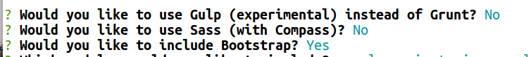
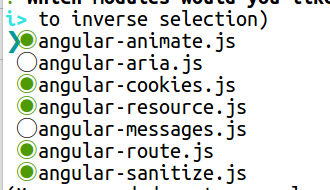
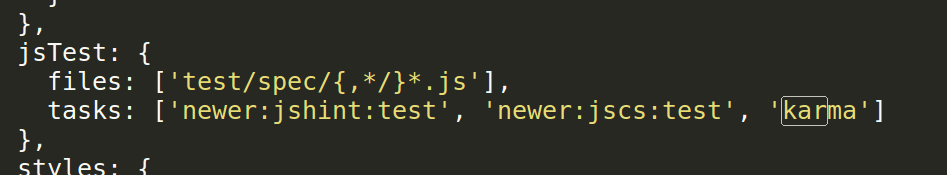

## yeoman环境的运行

接着上一节在当前文件夹新建一个文件夹自己命名

` mkdir my-new-project`

切换到你新建的文件夹

`cd my-new-project`

执行，[app-name] 选添，不写系统会给默认值

`yo angular [app-name]`

根据下图选择

 

按空格将所有的js文件选中，后按回车

 

这个过程可能时间比较长，耐心等候，出现下图代表完成

 

完成后执行下面的命令启动项目

`grunt serve`

启动项目自动打开浏览器如下图所示

 

查看控制台f12,如果有有关karma的报错，进入gruntfie.js文件将下图js代码删除

 

参考官方教程:[https://github.com/yeoman/generator-angular#readme](https://github.com/yeoman/generator-angular#readme) 

---

作者：朱晨澍