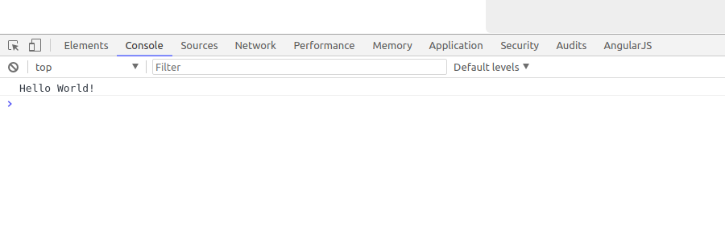

# 第三节 控制器

既然我们已经将项目初步启动起来了，那我们就开始教师管理模块。

## 目录结构

```
.
├── app
├── bower_components
├── bower.json
├── Gruntfile.js
├── node_modules
├── package.json
├── package-lock.json
├── README.md
└── test
```

而我们在项目中真正需要的就是app目录。


## 控制器

我们依次打开目录，`app/scripts/controllers/main.js`


`MVC`是软件开发中的一种优秀设计模式，即模型(model)、视图(view)、控制器(controller)。

我们打开的`main.js`，就是我们前台的控制器了。

打开`main.js`，将看到如下代码，这是`yeoman`为自动为我们生成的。


我们将`main.js`中的代码替换为如下代码。

```javascript
 // testApp模块中定义一个名为'MainCtrl'的控制器
angular.module('testApp')
  .controller('MainCtrl', function ($scope) {

    // 将$scope对象的helloWorld属性赋值为字符串Hello World!
    $scope.helloWorld = 'Hello World!';

    // 控制器打印$scope对象的helloWorld属性
    console.log($scope.helloWorld);
  });
```

**注意**

写完代码保存后要注意我们的终端，就是我们用来启动`grunt serve`命令的那个终端，如果代码有错误，终端中会出现对应的错误提示，类似下图。


## 简单理解

我们简单的理解这两行代码，`$scope`是一个对象，我们将`$scope`这个对象的`helloWorld`属相赋值为字符串`Hello World!`。

`console.log`，就是调用`console`对象的`log`方法，传入`$scope.helloWorld`。

这里的`console`对象，就是浏览器我们提供的控制台。

## 控制台

打开浏览器，右键，检查。


点击`console`，这就是控制台。



我们看到控制台中打印除了我们想要的`$scope.helloWorld`，也就是字符串`Hello World!`。

`console.log`表示在控制台打印日志，这会是我们以后常用的一个操作，务必牢记。

## $scope

为了易于理解，我们上文将`$scope`理解为一个普通对象，我们并没有定义这个对象，那么`$scope`究竟是什么，又是哪里来的呢？

`$scope`是AngularJS为我们封装好的一个对象，所以我们不需要定义。

像我们的代码一样，我们只需要在`function`中传入`$scope`这个对象，我们就可以直接在函数中使用。它是连接C层与V层之间的桥梁。

就像我们之前的代码一样：

```javascript
$scope.helloWorld = 'Hello World!';
```

我们就可以把`Hello World!`从我们的控制器传递给用于显示的视图层，同时，如果这个数据在V层被改变时，也会通过`$scope`来传回给我们的C层。

*作者：张喜硕*