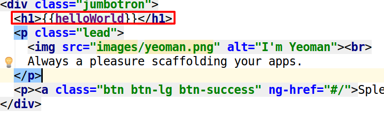
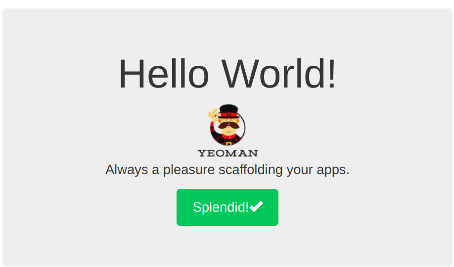
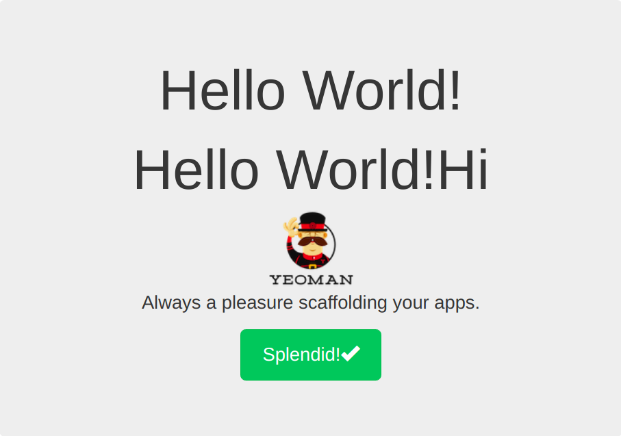
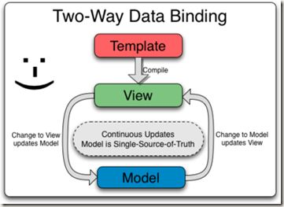
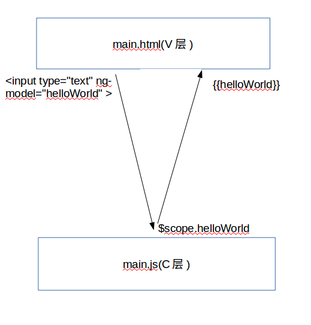
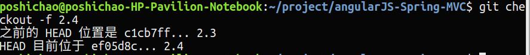

# 第四节 前台视图层建立

上一节我们在控制台中显示了Hello World，接下来我们将让Hello world显示在我们的前台界面中。

## 显示hello world！

我们先来修改一下 `main.html` 中的代码。

将`<h1></h1>` 标签中的内容换掉。

```html
<h1>{{helloWorld}}</h1>
```



然后我们看一下我们界面有什么变化。



可以看到，我们想要的 `Hello World！` 已经显示出来了。

## 数据绑定

在 `angularjs` 中，我们通常会在 `view` 层使用双花括号： `{{}}` 来绑定 `$scope` 上的变量。也就是说`{{helloWorld}}`中的 `helloWorld` ，会自动的赋值为 `main.js` 中 `$scope.helloworld` 的值。

**main.js**

```angularjs
angular.module('testApp')
  .controller('MainCtrl', function($scope) {
    $scope.helloWorld = 'Hello World!';
    $scope.hi = $scope.helloWorld + ' Hi!';
    console.log($scope.helloWorld);
  });
```

**main.html**
```html
<h1>{{helloWorld}}</h1>
<h1>{{hi}}</h1>
```

我们又定义了一个变量 `$scope.hi` ,将 `$scope.helloWorld` 的值后面添加上了 ` Hi` ，然后赋值给 `$scope.hi`。同时在V层进行一下数据绑定。再看看我们的界面有什么变化。



可以看到，又多了一行 `Hello World！ Hi` 。

**注意：** 时刻记得看控制台及shell，如果有出现 `error` ，对照一下代码，看看是哪块写错了。

## 双向数据绑定

`双向数据绑定` 是 `Angularjs` 的核心之一。
 
 
 
 所谓双向数据绑定，简单来说就是 `main.html(v层)` 做了一个修改，它会自动同步在 `main.js(c层)` 中，同样的，`main.js(c层)` 有了变化，也会自动同步到 `main.html(v层)` 中去。上代码。
 
 **main.html**
 
 ```html
<div class="jumbotron">
  <h1>{{helloWorld}}</h1>
  <h1>{{hi}}</h1>
  <p class="lead">
    <br>
    Always a pleasure scaffolding your apps.
    <!--视图层实现双向数据绑定用'ng-model'-->
    <input type="text" ng-model="helloWorld" >
  </p>
  <p><a class="btn btn-lg btn-success" ng-href="#/">Splendid!<span class="glyphicon glyphicon-ok"></span></a></p>
</div>
```

我们在视图层又添加了一个 `input` 输入框，用 `ng-model` 来绑定变量 `helloWorld`。

`<input type="text" ng-model="helloWorld" >` 使我们可以在 `main.html(V层)` 中改变这个变量的值，当它发生变化时，会实时传给 `main.js(C层)` 中的 `$scope` 的 `helloWorld`。这时， `main.js` 发现 `$scope` 的 `helloWorld` 改变了，就会立即通知 `main.html(V层)`
 的 `{{helloWorld}}`。所以，数据传递变化的顺序是：V层(`<input type="text" ng-model="helloWorld" >` )->C层(`$scope` 的 `helloWorld`)->V层(`{{helloWorld}}`)。即 `V->C->V` 的顺序。


 
 我们把这种V层实时传递数据给C层，C层同时又实时地将数据传递给V层的现象叫做 `双向数据绑定`。
 


可以看到，我们在输入框中改变了 `Hello World！` ，相应的，上面的 `Hello World！` 也随之改变。

双向数据绑定让我们只用进行一次绑定，而无需关心C层的变化。我们用了一份的精力，却完成了原来的两项工作。就这就是双向数据绑定的神奇之处。

## 官方

### 查看示例代码

打开终端，输入命令：

```bash
git checkout -f 2.4
```



----------------------

**官方参考文档：**
[https://docs.angularjs.org/api/ng/directive/ngBind](https://docs.angularjs.org/api/ng/directive/ngBind)

[https://docs.angularjs.org/guide/databinding](https://docs.angularjs.org/guide/databinding)

***作者：[朴世超](www.mengyunzhi.cn)***

