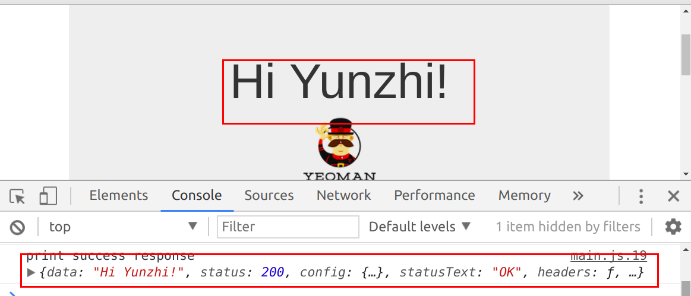

## 第五节 angularjs 模拟数据请求

本节我们来介绍angularjs如何发起http请求, 以获取一个http资源

为了要获取到数据，我们要建立数据，下面开始我们的工作，
首先在app目录下创建data文件夹，在data文件夹中建立helloWorld.txt,里面写入Hello World Yunzhi!

 

现在我们有了数据了就要开始数据请求，我们通过$http来请求数据,$http 是 AngularJS 中的一个核心服务，用于读取远程服务器的数据。
以$开头的服务，都是angulajs的自带服务。

 1. 在书写代码时，先书写`$http.get().then();`方法，git获取请求地址，then发起请求，读取远程服务器的数据
 
 ```
 angular.module('testApp')
    .controller('MainCtrl', function($scope, $http) {
        var url = 'http://localhost:9000/data/helloWorld.txt'; //  http请求的地址
        $http.get(url).then();
    });
 ```
 
 2. 然后再定义请求成功后执行`var success = function() {};`函数，请求失败后执行`var error = function() {};`函 数
 
 ```
 angular.module('testApp')
    .controller('MainCtrl', function($scope, $http) {
        var url = 'http://localhost:9000/data/helloWorld.txt'; //  http请求的地址
        // 请求成功执行代码
        var success = function() {
            console.info('print success response');
        };
        // 请求失败执行代码
        var error = function() {
            console.error('$http -> ' + url + ' error.');
        };
        $http.get(url).then();
    });
 ```
 
 3. 然后再将success 和 error  放入then中`$http.get().then(success, error);`。
 
 ``` javascript
angular.module('testApp')
    .controller('MainCtrl', function($scope, $http) {
        var url = 'http://localhost:9000/data/helloWorld.txt';  //  http请求的地址
        // 请求成功执行代码
        var success = function(response) {
            console.info('print success response', response);
        };
        // 请求失败执行代码
        var error = function(response) {
            console.error('$http -> ' + url + ' error.', response);
        };
        $http.get(url).then(success, error);  // get获得请求地址，then发起请求，请求成功执行第一个函数，失败执行第二个
    });
  ```
  
 也可以直接将success和error函数放入then中。
  
  ```  javascript
   angular.module('testApp')
    .controller('MainCtrl', function($scope, $http) {
        var url = 'http://localhost:9000/data/helloWorld.txt';  // http请求的地址
        // get获得请求地址，then发起请求，请求成功执行第一个函数，失败执行第二个
        $http.get(url)
            .then(function success(response) { // 请求成功
                console.info('print success response', response);
            }, function error(response) { // 请求失败
                console.error('$http -> ' + url + ' error.', response);
            });
    });
```
  
  是的，你没有看错，我们直接将success 和 error两个函数做为参数传给了$http.get(url).then()。就也是javascript与我们学过的传统语言最大的不同。在我们以前 的习惯中，我们只会将变量、对象做为参数传给另一个方法。但javascript中，函数也可以像参数一样传过去。
而且慢慢的我们发现，相对于提前定义，我们更愿意这样使用：

 
  
  请求成功结果入图所示
  
  
 
 如果http请求错误如url写错
 
 `var url = 'http://localhost:9000/data/helloWorld1.txt'`
 
 显示如图，执行then的第二个方法（第二个报错）
 
  
 
 下面将获取到的数据返回到v层
 
 c层代码(main.js)
 
 ```javascript
 angular.module('testApp')
    .controller('MainCtrl', function($scope, $http) {
        // http请求的网址
        var url = 'http://localhost:9000/data/helloWorld.txt';
        // get获得请求地址，then发起请求，请求成功执行第一个函数，失败执行第二个
        $http.get(url)
            .then(function success(response) { // 请求成功
                // 控制台打印
                console.info('print success response', response);
                // 返回v层
                $scope.helloWorld = response.data;
            }, function error(response) { // 请求失败
                console.error('$http -> ' + url + ' error.', response);
            });
    });
 ```
 
 v层代码(mian.html)
 
 ```angularjs
 <div class="jumbotron">
    <h1> {{helloWorld}} </h1><!-- c层数据引入 -->
    <p class="lead">
        
        <br> Always a pleasure scaffolding your apps.
    </p>
    <p><a class="btn btn-lg btn-success" ng-href="#/">Splendid!<span class="glyphicon glyphicon-ok"></span></a></p>
</div>
 ```
 
 结果如图
 
  
 
  下面我们改变helloWorld.txt里的数据将Hello World Yunzhi!改为Hi Yunzhi!,观察数据变化
  
    
  
  根据时序图理解一下本节的数据传输
  
   
  
  ---
  
  作者：朱晨澍