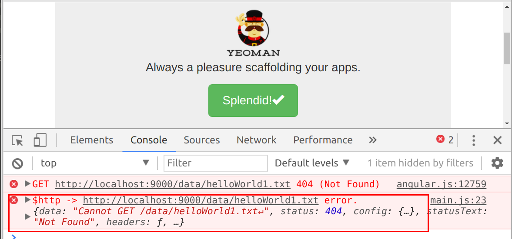

## 第五节 angularjs 模拟数据请求

本节主要介绍前台如何向后台发起http请求，为了个好理解，本节先介绍利用http向本地请求模拟数据并在前台显示出来。

为了要获取到数据，我们要建立数据，下面开始我们的工作，
首先在app目录下创建data文件夹，在data文件夹中建立helloWorld.txt

 

现在我们有了数据了就要开始数据请求，我们通过$http来请求数据，先将$http 注入到 c 层，也就是controller里的main.js 文件中

``` javascript
angular.module('testApp')
  .controller('MainCtrl', function($scope, $http) {
  	// http请求的网址
  	var url = 'http://localhost:9000/data/helloWorld.txt';
  	// get获得请求地址，then发起请求，请求成功执行第一个函数，失败执行第二个
  	$http.get(url)
    .then(function success(response) { // 请求成功
    	// 控制台打印
        console.info('print success response', response);
    }, function error(response){      // 请求失败
        console.error('$http -> ' + url + ' error.', response);
    });
  });
  ```
  
  请求成功结果入图所示
  
  
 
 如果http请求错误如url写错
 
 `var url = 'http://localhost:9000/data/helloWorld1.txt'`
 
 显示如图，执行then的第二个方法（第二个报错）
 
  
 
 下面将获取到的数据返回到v层
 
 c层代码
 
 ```javascript
 angular.module('testApp')
  .controller('MainCtrl', function($scope, $http) {
  	// http请求的网址
  	var url = 'http://localhost:9000/data/helloWorld.txt';
  	// get获得请求地址，then发起请求，请求成功执行第一个函数，失败执行第二个
  	$http.get(url)
    .then(function success(response) { // 请求成功
    	// 控制台打印
        console.info('print success response', response);
        // 返回v层
        $scope.helloWorld = response.data;
    }, function error(response){      // 请求失败
        console.error('$http -> ' + url + ' error.', response);
    });
  });
 ```
 
 v层代码
 
 ```javascript
 <div class="jumbotron">
  <h1>{{helloWorld}}</h1><!-- c层数据引入 -->
  <p class="lead">
    <br>
    Always a pleasure scaffolding your apps.
  </p>
  <p><a class="btn btn-lg btn-success" ng-href="#/">Splendid!<span class="glyphicon glyphicon-ok"></span></a></p>
</div>
 ```
 
 结果如图
 
  
 
  下面我们改变helloWorld.txt里的数据将Hello World Yunzhi!改为Hi Yunzhi!,观察数据变化
  
    
  
  根据时序图理解一下本节的数据传输
  
   
  
  ---
  
  作者：朱晨澍