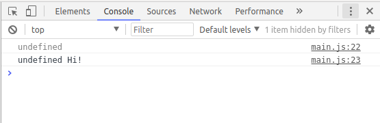
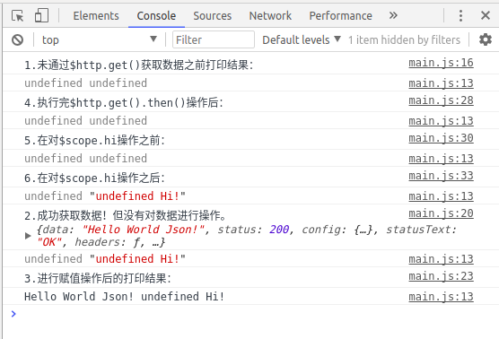

# 异步机制
本节我们讲解一下angularJS里面的一个很重要的机制：**异步机制**


## 什么是异步机制？
> 异步使得我们可以在进行资源请求时，并行去处理其它的事情。还可以到程序中做个定时任务，当时间到了设定值时自动执行。

<hr>

比如，你大学的主要任务是打游戏，那么你可能需要这样的流程：
打游戏 -> 告诉同学小王：到中午了你叫我 -> 打游戏 -> 接到小王到中午的通知 -> 订外卖 -> 打游戏 -> 外卖送到 -> 吃饭 -> 打游戏。

注意这里的```告诉同学小王叫你```和```打游戏```都是你自己的行为，也就是说异步是相对于你自己而言的，只不过你不需要关心你下达完命令产生的效果（你不会因为小王帮你看点或者外卖小哥冒雨给你送外卖而不打游戏）。其实异步想实现的就是让你和小王或者外卖小哥所做的事在同时发生。

下面我们对比同步异步帮你更好的理解：
- 同步：我让你做事情的同时，我还看着你做事情，你要没做完，我就一直等着，直到你做完了，我再做别的事情。
- 异步：我让你做事情的同时，我继续干别的事情，你要是没做完，我就接着干别的事情，一旦你做完了，我便停下手来去响应你。


## 异步实例

### 1.接收模拟数据并查看结果
现在我们要把模拟数据的内容接收过来，然后对其中的某个属性值进行修改。
我们一般的思路：
- 首先把模拟数据中所有的数据都传过来；
- 定义一个变量用来接收要修改的数据；
- 最后定义一个新的变量来保存修改后的内容。

```javascript
angular.module('testApp')
    .controller('MainCtrl', function($scope, $http) {

        // 通过路由获取传过来的数据
        var url = 'http://localhost:9000/data/helloWorld.txt';
        $http.get(url)

            // 判断是否传过来，并接收数据
            .then(function success(response) {
                $scope.helloWorld = response.data;
            }, function error(response) {
                console.error('$http -> ' + url + ' error.', response);
            });

        // 实现改变值
        $scope.hi = $scope.helloWorld + ' Hi!';

        // 查看一下结果
        console.info($scope.helloWorld);
        console.info($scope.hi);
    });
```

打开控制台查看一下结果：显示$scope.helloWorld这个属性没有被定义**undefined**



作为新手的我们无意间就踩坑了，但老师鼓励我说大牛就是这样炼成的。

### 2.代码执行步骤

我们用代码来解释一下这个问题，有时候代码能更好解释某个问题。

```javascript
angular.module('testApp')
    .controller('MainCtrl', function($scope, $http) {

        // 定义一个函数，用于打印输出值
        var print = function() {
            console.info($scope.helloWorld, $scope.hi);
        };

        // 打印未获取数据之前的结果
        console.log('1.未通过$http.get()获取数据之前打印结果：');
        print();

        // 通过路由获取传过来的数据
        var url = 'http://localhost:9000/data/helloWorld.txt';
        $http.get(url)
            .then(function success(response) {

                // 打印获取结果和查看传过来的数据
                console.info('2.成功获取数据！但没有对数据进行操作。', response);
                print();

                // 接收传过来的值
                $scope.helloWorld = response.data;

                // 打印传过来后并赋值后的结果
                console.info('3.进行赋值操作后的打印结果：');
                print();
            }, function error(response) {
                console.error('$http -> ' + url + ' error.', response);
            });

        // 执行完我们认为执行完的$http.get().then()后
        console.log('4.执行完$http.get().then()操作后：');
        print();

        // 打印未对$scope.hi操作之前的结果
        console.log('5.在对$scope.hi操作之前：');
        print();

        // 对 $scope.hi 进行赋值
        $scope.hi = $scope.helloWorld + ' Hi!';

        // 打印对 $scope.hi 进行操作之后的结果
        console.log('6.在对$scope.hi操作之后：');
        print();
    });

 
```


我们正常的逻辑顺序是从上往下1->2->3->4->5->6依次执行，但控制台给我们的结果是：



1->4->5->6->2->3这个顺序，其实就是获取数据的操作还没完,就急着执行下面的了，这就是异步机制。
 
 获取实例代码请输入命令：```git checkout -f  2.6``` 

### 3.问题如何解决
如果能按照我们设定的 1->2->3->4->5->6依次执行呢？ ---- 回调函数。


<hr>

*作者：陈志高*


