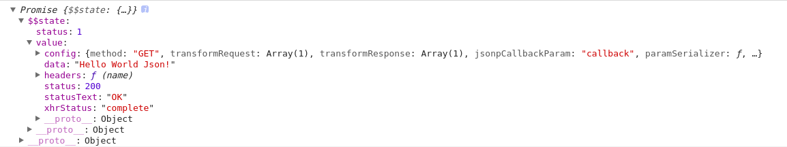

# 第七节 回调函数

回调函数是一个很重要的概念，Google回调时找到了很多篇博客，但觉得讲解地不够深刻、不够清楚。就自己去思考，希望本文能对你在回调函数的认识上有所帮助。

## 例子

小王：学习->中午：学习->学习

我们：打游戏->告诉小王：中午叫我->打游戏

我们告诉小王：中午叫我。当时间到达中午时叫我。

当事件到达中午这个事件被触发时，小王就会调用“叫我”这个方法作为这个事件的响应。

也就是说，虽然“叫我”这个方法是我们定义的，但是却归小王调用。

这样就简化了我们的很多操作，我们不需要知道怎么去判断时间是否到达中午，这些操作小王都帮我们完成了，我们直接抛给小王一个“叫我”函数，他就会在条件满足时回来调用我们定义的函数。

我们传给小王的“叫我”函数，就是回调函数。

## 回调

这里我们使用`AngularJS`框架，我们调用框架中的函数，这个过程叫做`Call`，调用。

而如果我们写了一个函数，把这个函数传给框架中的某个方法，交给框架去调用，这个过程就叫做`CallBack`，回调。

这里所说的框架只是举个比较容易的例子，某一个方法，去调用我们所写的当前方法，就是回调。

## 代码

```javascript
// 定义thenTest函数
var thenTest = function(successCallback, errorCallback) {
    ...
};
// 定义successFunction函数
var successFunction = function() {
    console.info('sucess');
};
// 定义errorFunction函数
var errorFunction = function() {
    console.info('error');
};
// 调用thenTest函数，并传入两个参数
thenTest(successFunction, errorFunction);
```

某天，程序员甲写了`thenTest`函数，他告诉我们，这个函数需要两个函数作为参数，成功就执行第一个，失败就执行第二个。

我们直接使用`thenTest`函数，并传入两个参数，这里，我们不需要知道甲在`thenTest`内部究竟是怎么判断是执行成功还是执行失败的，我们只需要知道对应着不同的状态需要执行什么操作就可以了。

我们似乎了解了回调的本质：响应状态的操作。

## 优点

```javascript
var url = 'http://localhost:9000/data/helloWorld.txt';
$http.get(url).then(success(response) {}, error(response) {});
```

就拿我们之前写过的代码为例，我们的`then`方法用到了回调函数，我们对比一下，就能了解回调函数的优点。

```javascript
var url = 'http://localhost:9000/data/helloWorld.txt';
console.log($http.get(url));
```

我们不用包含回调的`then`方法，我们就打印出来看看`$http.get(url)`的返回值到底是什么！



我们看到打印结果，返回值是一个拥有很多属性`Promise`对象，但是这个对象怎么用呢？这个对象的一堆什么`$$state`、`value`、`config`等属性，怕是只有`Google`内部维护这个框架的工程师才能看懂都是什么属性吧。

那我们想去判断返回值，然后成功就执行数据传输操作，失败就在控制台打印错误提示改怎么办呢？如果我们不用回调函数，那我们就需要去看`AngularJS`的框架中对`Promise`对象的各种属性是怎么定义的了，这就无意中提高了我们的学习成本，降低了我们的效率，这与我们要使用框架提高开发效率的初衷不符。

所以框架为我们封装了一些方法(例如我们用到的`then`方法)，引入了`JavaScript`的回调机制，我们将我们想要在不同状态下执行的操作传过去，而框架底层已经为我们写好了那些判断`Promise`对象各种状态的代码，我们只需写好函数，等着框架解析完对象，然后去调用我们提供给框架的回调函数，就解决了问题。

这样，实现者(框架的维护者)与调用者(我们)相分离，符合面对对象高内聚低耦合的设计思想。

## 参考资料

[浅析系统设计中的回调思想](http://blog.csdn.net/a910626/article/details/45920893)

*作者：张喜硕*