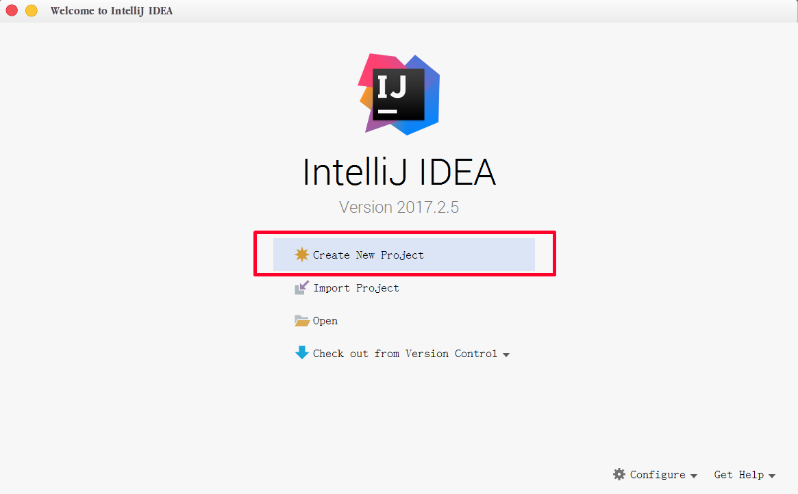

参考：http://spring.io/guides/gs/rest-service/
初始化springmvc下的rest服务。
注意：严格按官方教程顺序来。但我们的目的是输出HelloWorld，所以需要对官方教程的一些信息进行一些改动.

1. 修改pom.xml中的以下两个字段的值：

    <groupId>org.springframework</groupId> -> <groupId>com.mengyunzhi</groupId>
    <artifactId>gs-rest-service</artifactId> -> <artifactId>angularjs-springmvc</artifactId>

2. 控制器文件，我们去除 src/main/java/hello/GreetingController.java 文件。新建 src/main/java/com/mengyunzhi/HelloWorld.java
并加入 say()方法
```
@RequestMapping("/HelloWorld")
public String say() {
	echo `helloWorld`;
}
```
3. 主文件，我们将 src/main/java/hello/Application.java 修改为： src/main/java/com/mengyunzhi/Application.java

4. 按官教程启动项目
If you are using Maven, you can run the application using `./mvnw spring-boot:run`. Or you can build the JAR file with `./mvnw clean package`. Then you can run the JAR file:

```
java -jar target/gs-rest-service-0.1.0.jar
```

# 第八节 后台服务初始化

本节，我们将创建后台服务，开始后台代码的编写。

## 创建maven项目

前面我们已经知道了 `maven` 这个神奇的小东西，接下来我们就来创建一个依赖于maven的项目。

**新建api文件夹**

在项目的根目录下新建一个文件夹，命名为 `api`。


**打开IDEA**



**创建maven项目**

选择 `Create new project` ，然后在左侧选择 `Maven`。


什么也不要点，直接点击 `Next` 下一步。


在 `GroupId` 里输入 `com.mengyunzhi` ，在 `ArtifactId` 里输入 `angularjs-spring-mvc` 。这里直接按照我们的教程命名，后面我会简单介绍这两个名称。

下一步。


修改一下我们的项目路径 `project location` ，将项目放到我们刚刚新建的 `api` 文件夹下。 `Finish` 完成。


我们会发现在右下脚出现一个