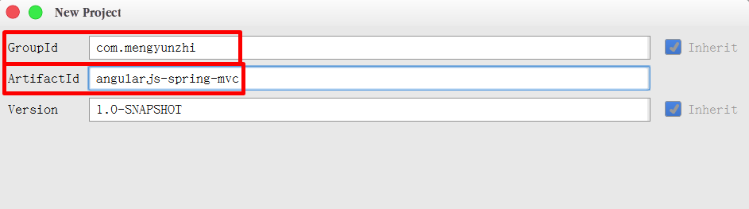
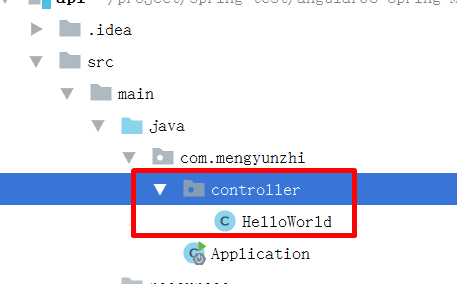
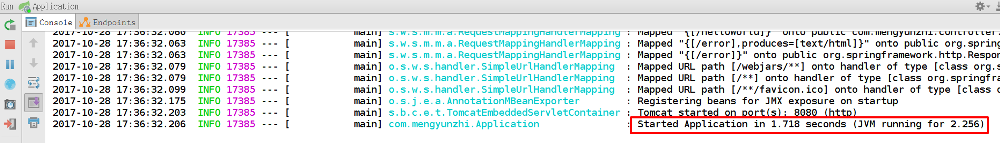

参考：http://spring.io/guides/gs/rest-service/
初始化springmvc下的rest服务。
注意：严格按官方教程顺序来。但我们的目的是输出HelloWorld，所以需要对官方教程的一些信息进行一些改动.

1. 修改pom.xml中的以下两个字段的值：

    <groupId>org.springframework</groupId> -> <groupId>com.mengyunzhi</groupId>
    <artifactId>gs-rest-service</artifactId> -> <artifactId>angularjs-springmvc</artifactId>

2. 控制器文件，我们去除 src/main/java/hello/GreetingController.java 文件。新建 src/main/java/com/mengyunzhi/HelloWorld.java
并加入 say()方法
```
@RequestMapping("/HelloWorld")
public String say() {
	echo `helloWorld`;
}
```
3. 主文件，我们将 src/main/java/hello/Application.java 修改为： src/main/java/com/mengyunzhi/Application.java

4. 按官教程启动项目
If you are using Maven, you can run the application using `./mvnw spring-boot:run`. Or you can build the JAR file with `./mvnw clean package`. Then you can run the JAR file:

```
java -jar target/gs-rest-service-0.1.0.jar
```

# 第八节 后台服务初始化

本节，我们将创建后台服务，开始后台代码的编写。

## 创建maven项目

前面我们已经知道了 `maven` 这个神奇的小东西，接下来我们就来创建一个依赖于maven的项目。

**新建api文件夹**

在项目的根目录下新建一个文件夹，命名为 `api`。


**打开IDEA**


**创建maven项目**

选择 `Create new project` ，然后在左侧选择 `Maven`。


什么也不要点，直接点击 `Next` 下一步。



在 `GroupId` 里输入 `com.mengyunzhi` ，在 `ArtifactId` 里输入 `angularjs-spring-mvc` 。这里直接按照我们的教程命名，后面我会简单介绍这两个名称。

下一步。


修改一下我们的项目路径 `project location` ，将项目放到我们刚刚新建的 `api` 文件夹下。 `Finish` 完成。


我们会发现在右下脚出现一个小提示框，它说maven项目需要导入，我们选择第二个 `Enable Auto-Import` 。这样，下次就不需要我们手动导入maven依赖了，IDEA会为我们自动完成。

```xml
<?xml version="1.0" encoding="UTF-8"?>
<project xmlns="http://maven.apache.org/POM/4.0.0"
         xmlns:xsi="http://www.w3.org/2001/XMLSchema-instance"
         xsi:schemaLocation="http://maven.apache.org/POM/4.0.0 http://maven.apache.org/xsd/maven-4.0.0.xsd">
    <modelVersion>4.0.0</modelVersion>

    <groupId>com.mengyunzhi</groupId>
    <artifactId>angularjs-spring-mvc</artifactId>
    <version>1.0-SNAPSHOT</version>

</project>
```

可以看到显示上面的信息。

点开左侧的 `api`。


对照一下你的项目结构。一开始最好保持与我们的目录结构一致，随着你对项目的熟悉，就可以按照自己的想法创建你的目录结构了。OK！到这里，我们的maven项目已经建好了。

## 配置pom.xml

maven项目创建好后，我们就要开始配置一下 `pom.xml` 文件了。

```xml
<?xml version="1.0" encoding="UTF-8"?>
<project xmlns="http://maven.apache.org/POM/4.0.0"
         xmlns:xsi="http://www.w3.org/2001/XMLSchema-instance"
         xsi:schemaLocation="http://maven.apache.org/POM/4.0.0 http://maven.apache.org/xsd/maven-4.0.0.xsd">
    <modelVersion>4.0.0</modelVersion>
    
    <!--项目信息-->
    <groupId>com.mengyunzhi</groupId>
    <artifactId>angularjs-spring-mvc</artifactId>
    <version>1.0-SNAPSHOT</version>
    
    <!-- 继承org.springframework.boot组织下的spring-boot-starter-parent项目 -->
    <parent>
        <groupId>org.springframework.boot</groupId>
        <artifactId>spring-boot-starter-parent</artifactId>
        <version>1.5.8.RELEASE</version>
    </parent>

    <dependencies>
        <!--spring-boot框架下的web项目依赖-->
        <dependency>
            <groupId>org.springframework.boot</groupId>
            <artifactId>spring-boot-starter-web</artifactId>
        </dependency>
        
        <!--spring-boot 单元测试依赖-->
        <dependency>
            <groupId>org.springframework.boot</groupId>
            <artifactId>spring-boot-starter-test</artifactId>
            <scope>test</scope>
        </dependency>
        
    </dependencies>

    <properties>
        <!--jdk版本-->
        <java.version>1.8</java.version>
    </properties>


    <build>
        <!--插件-->
        <plugins>
            <plugin>
                <groupId>org.springframework.boot</groupId>
                <artifactId>spring-boot-maven-plugin</artifactId>
            </plugin>
        </plugins>
    </build>

    <repositories>
        <repository>
            <id>spring-releases</id>
            <url>https://repo.spring.io/libs-release</url>
        </repository>
    </repositories>
    <pluginRepositories>
        <pluginRepository>
            <id>spring-releases</id>
            <url>https://repo.spring.io/libs-release</url>
        </pluginRepository>
    </pluginRepositories>
</project>
```

刚开始我们并不需要知道上面的代码具体都是干什么的，简单了解，然后直接复制到你的文件中就可以了。

下面我来简单介绍一下上面的几个标签。

**groupId：** 组织名。 

**artifactId：** 项目名。

这两条信息就像一个坐标，它能帮助别人找到我们的项目，加以依赖。

**version：** 版本信息。

**parent：** 继承。我们建立的项目是继承了spring的框架。

**dependencies和dependency：** 注入依赖。这里面添加我们的项目依赖。`<dependency>` 里写入需要以来的信息，然后都放入到 `<dependencies>` 中。以后我们还会添加很多依赖，都会以这种形式添加到项目中。

我们现在添加了两个依赖，第一个是spring框架下的web项目依赖，第二个是spring的单元测试的依赖，这个我们后面会接触到。

其余的我们现在不用知道，相信随着学习的深入，你会对它们的作用有更好的了解。

## 创建启动项

**新建文件**

右键 `java` ，新建一个 `com.mengyunzhi` 包，然后在 `com.mengyunzhi` 中新建一个 `Application` 的类。



**编写启动项**

打开 `Application`，复制下面的代码。

```java
package com.mengyunzhi;

import org.springframework.boot.SpringApplication;
import org.springframework.boot.autoconfigure.SpringBootApplication;

// @SpringBootApplication是一个springBoot启动项注解，整个项目会从这里开始执行。
@SpringBootApplication
public class Application {

    public static void main(String[] args) {
        SpringApplication.run(Application.class, args);
    }
}
```

> 在springMVC项目中我们将大量使用以 "@" 注解来进行声明。

**启动项目**

点击左侧绿色的小三角，来启动我们的项目。



看到我们的控制台出现这样的信息，就说明我们的项目已经成功启动。

## helloworld

**新建文件**


我们