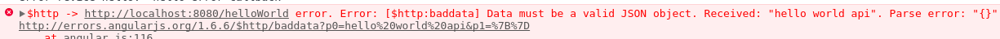
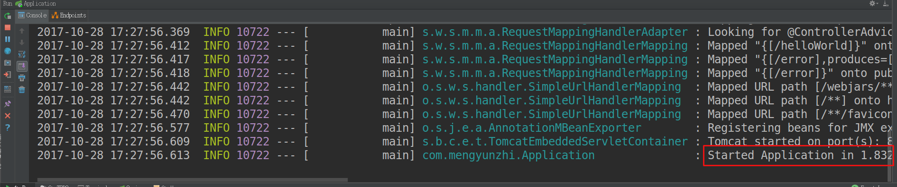
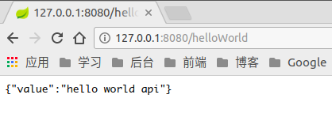

# 第九节 后台完善

## 控制器

上一节中，我们写了一段这样的代码，下面，我们深度学习一下`SpringMVC`控制器。

```java
package com.mengyunzhi.controller;

import org.springframework.web.bind.annotation.RequestMapping;
import org.springframework.web.bind.annotation.RestController;

// RestController注解：声明一个控制器
@RestController
public class HelloWorld {

    // RequestMapping注解：将/helloWorld映射到say方法上。
    @RequestMapping("/helloWorld")
    public String say() {
        return "hello world api";
    }
}
```

在`SpringMVC`中，控制器`Controller`负责处理由`DispatcherServlet`分发的请求。

我们不需要知道`DispatcherServlet`到底是什么，那是框架为我们写好的，在前期，我们了解即可。

定义一个控制器非常简单，我们在类上添加`@RestController`注解即可，`SpringMVC`即可自动扫描。

```java
// RequestMapping注解：将/helloWorld映射到say方法上。
@RequestMapping("/helloWorld")
public String say() {
    return "hello world api";
}
```

这里的`@RequestMapping`是用来构建`url`与方法之间的映射的，`url`就是我们在浏览器地址栏输入的类似`www.baidu.com`之类的网址，我们可以理解为，`@RequestMapping`将`/helloWorld`这个地址映射到`say`方法上。

项目启动后，当用户对`127.0.0.1:8080/helloWorld`发起请求时，`SpringMVC`框架的`DispatcherServlet`就会截获这个请求，然后把这个请求交给控制器去处理。

然后控制器会在自己定义的方法中寻找映射`/helloWorld`的方法，找到了，就执行，找不到，就抛出异常。

## 数据类型

我们来理一下前台请求后台的流程。

前台`$http`发送请求->控制器处理请求->返回数据->前台使用

返回数据时，我们就需要思考，前台想获取的是什么格式的数据呢？是`Json`类型还是其他常见类型呢？我们试一下。



我们看到，如果我们直接将我们的字符串`"hello world api"`返回给前台，会报错，提示信息为`Data must be a valid JSON object`，数据必须是一个有效的`Json`对象。

所以要返回给前台`Hello World`，我们后台不能仅仅返回一个字符串，前台需要的是`Json`对象。

## 方法修改

既然前台需要对象，那我们就返回一个`Json`对象，对方法进行如下修改。

```java
package com.mengyunzhi.controller;

import org.springframework.web.bind.annotation.RequestMapping;
import org.springframework.web.bind.annotation.RestController;

// RestController注解：声明一个控制器
@RestController
public class HelloWorld {

    // RequestMapping注解：将/helloWorld映射到say方法上。
    @RequestMapping("/helloWorld")
    public SayHello say() {
    
        // 新建一个SayHello类的对象sayHello
        SayHello sayHello = new SayHello();
        // 调用sayHello的setValue方法，设置value为"hello world api"
        sayHello.setValue("hello world api");
        // 返回sayHello对象
        return sayHello;
    }

    // 定义一个静态内部类SayHello
    public static class SayHello {
    
        private String value;

        public String getValue() {
            return value;
        }

        public void setValue(String value) {
            this.value = value;
        }
    }
}
```

我们在控制器中定义了一个静态内部类，`say`方法中新建`SayHello`对象，设置`value`，返回该对象。

有人可能会有疑问了，我们这里返回的可以是任意一个类的对象，前台需要的是`Json`格式的对象啊？那么`SpringMVC`返回给前台的到底是什么，我们来试一下。



运行项目，`com.mengyunzhi.Application : Started Application`。

打开浏览器，输入`http://127.0.0.1:8080/helloWorld`，我们看到返回的就是一个`Json`对象！



我们建立`HelloWorld`类时使用的注解是`@RestController`，该方法不单单定义一个控制器，而且声明为`Restful`风格，将返回的对象转化为我们常用的轻量级的`Json`格式。

前台获取到这个对象后，直接调用`value`属性就能获取我们要传过去的`"hello world api"`了。