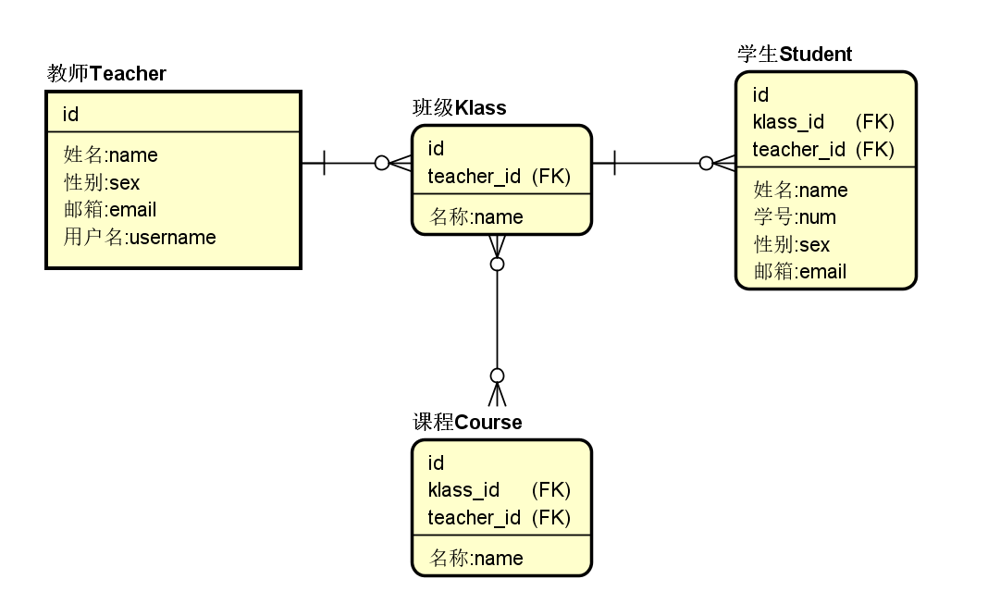
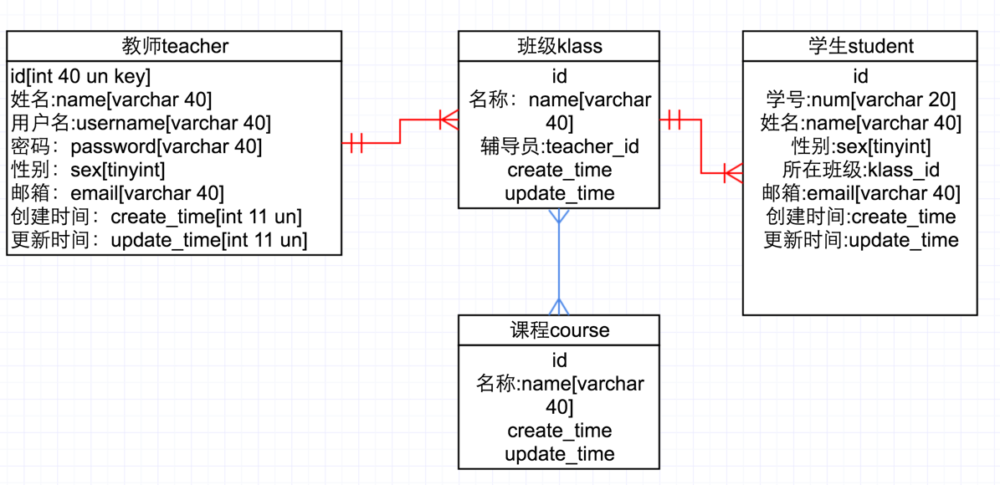

# 3.1.1 E-R图

## 数据库设计

`E-R`图也称实体-联系图(`Entity Relationship Diagram`)，提供了表示实体类型、属性和联系的方法，用来描述现实世界的概念模型。

随着数据量越来越大，我们的数据库也顺应时代升级为了关系型数据库，而我们绘制的`ER`图就是将数据库的整个逻辑结构标示出来。

好的数据库设计可以减少不必要的数据冗余，通过合理的数据规划提高系统的性能。

## 实体间关系

我们一共有四个实体，“教师”、“班级”、“学生”、“课程”。

一个教师可以管理多个班级、一个班级有多个学生，一个班级可以上多门课程，同时，多个班级也可以上同一门课程。

教师->班级 一对多 1:n

班级->学生 一对多 1:n

班级->课程 多对多 m:n

***绿色框框中的线型，是1：1；蓝色框框中的线型，是m:n；红色框框中是1:n。当然了，除了上述三种关系以后，我们看到还有其它的线型，在这里，我们不做过多的学习，掌握住上面三种线型，再结合我们团队总结出的一些方法，对于前期我们做中小型项目而言，已经完全够用了。***

## E-R图

理清各个实体间的关系后，我们设计如下E-R图。

*作者：张喜硕*