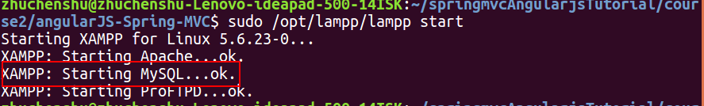
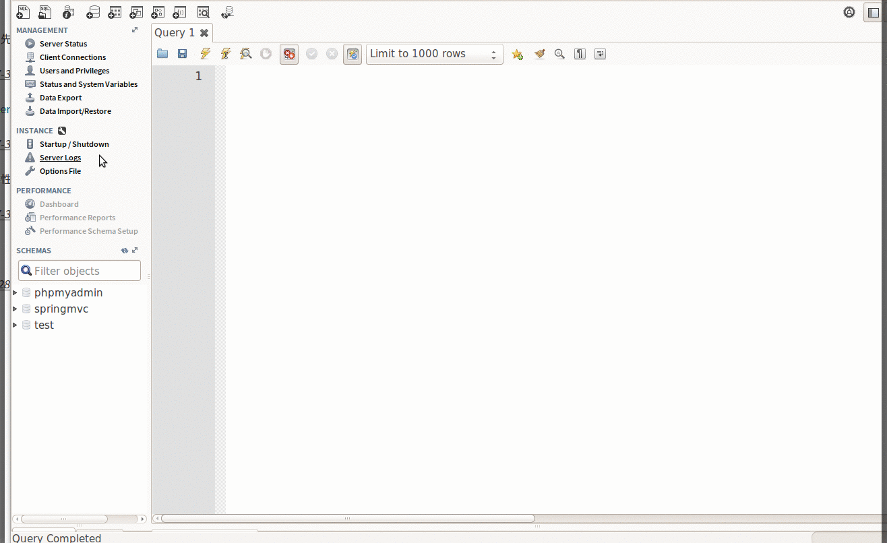

## 3.1.2建立数据库

在建立数据库之前，我们先要用`xampp`启动`mysql`服务。

 

然后打开`MySQL Workbench`,双击下图按钮

 

会跳出警告，提示你兼容性问题，但你不用管他点击继续。

 

按下图步骤建立数据库，数据库的名字是`angular-springmvc`：

`utf8 - utf8_general_ci`的意思是使用的编码格式是`utf8`，使用的排序规则为`utf8_general_ci`