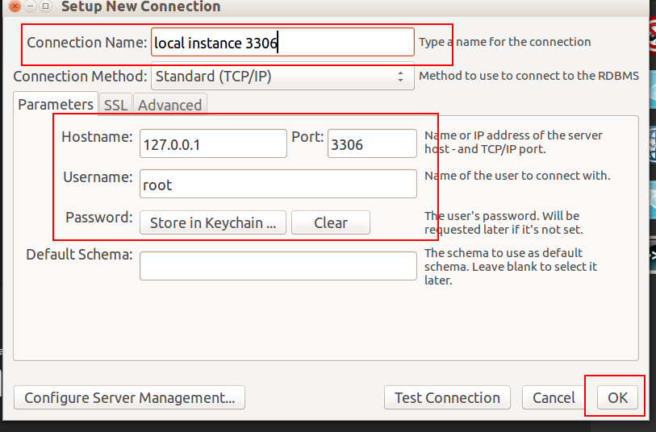

## 3.1.2创建数据库

在建立数据库之前，我们先要用`xampp`启动`mysql`服务。

 

**开始创建数据库**

---

然后打开`MySQL Workbench`新建连接，点击图上标记的加号：

 

为数据库连接起一个名字，注意查看你的配置信息：
主机名：127.0.0.1
端口：3306
用户名：root
密码：（空）
后点击ok：

 

双击下图按钮

 

会跳出警告，提示你版本兼容性问题，但你不用管他点击继续。

 

按下图步骤建立数据库，数据库的名字是`angularjs-springmvc`：

`utf8 - utf8_general_ci`的意思是使用的编码格式是`utf8`，使用的排序规则为`utf8_general_ci`

---

作者：朱晨澍