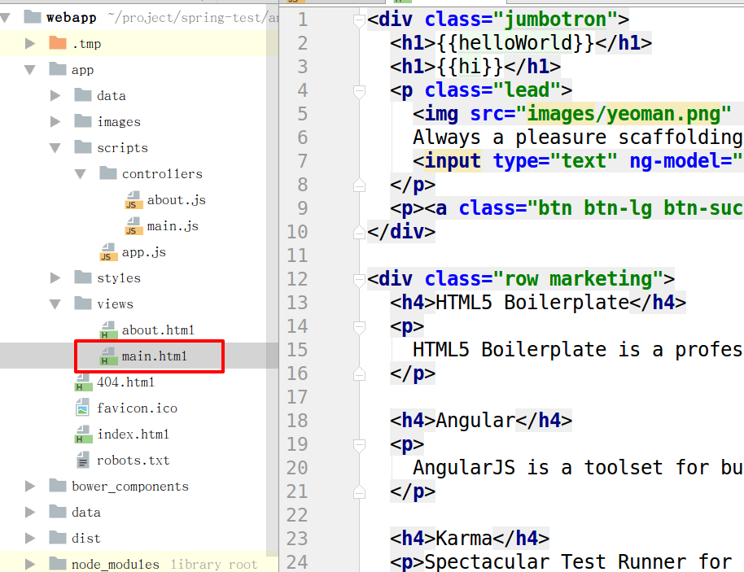

# 前台 视图层建立

在进行项目开发时，往往都是先设计出原型，然后再根据原型实现具体功能。我们现在要做的就是设计出我们的原型。

## main.html



打开 `main.html`, 删除其中所有代码，然后将下面的代码写进去。

```html
<div class="row marketing">
  <table>
    <tr>
      <th>id</th>
      <th>name</th>
      <th>sex</th>
      <th>email</th>
      <th>username</th>
    </tr>
    <tr>
      <td>1</td>
      <td>zhangsan</td>
      <td>0</td>
      <td>zhangsan@mengyunzhi.com</td>
      <td>zhangsan</td>
    </tr>
    <tr>
      <td>2</td>
      <td>lisi</td>
      <td>1</td>
      <td>lisi@mengyunzhi.com</td>
      <td>lisi</td>
    </tr>
  </table>
</div>
```

没错，就是这样的，我们通常会先写一些示例数据，来模拟最终我们想要的数据的样子。这就是我们说的原型。

## 测试


好了，虽然看起来很丑的界面，就是我们要的最初的样子。以后随着对项目的熟悉，我们可能会把界面的美化加进来。

### 查看示例代码

```bash
git checkout -f 3.2.2-webapp-view
```

--------------
***作者：[朴世超](www.mengyunzhi.cn)***
