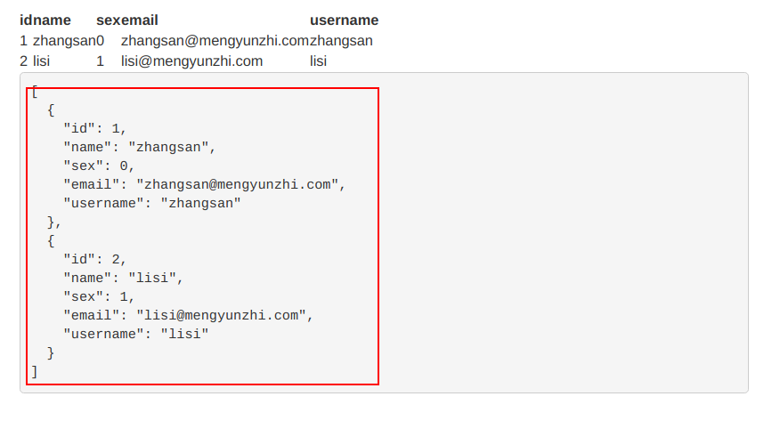

## 3.2.3 从前台c层读取数据

上一节中，我们直接将数据写在`v`层，来显示我们想要的效果，实际项目中我们`v`层的数据来自`c`层，本节中，我们将试着前台从`c`层读取数据显示在`v`层。

如图，我们要编写的`v`层`main.html`对应的`c`层代码为`main.js`

 

首先我们将前台要显示的数据添加到`c`层，在这里我们来添加`JSON`格式数据。`JSON` 语法是 `JavaScript` 对象表示法语法的子集。在`javascript`中，我们使用[]来定义一个数组。使用`{}`来定义一个对象。在对象中，使用`key: value`来声明一个属性及该属性对应的值 ，数据由逗号分隔。

下面给出两种写法：

第一种便于理解

```javascript
angular.module('testApp')
  .controller('MainCtrl', function($scope) {
    var data = [{
        id: 1,
        name: 'zhangsan',
        sex: 0,
        email: 'zhangsan@mengyunzhi.com',
        username: 'zhangsan'
      },
      {
        id: 2,
        name: 'lisi',
        sex: 1,
        email: 'lisi@mengyunzhi.com',
        username: 'lisi'
      }
    ];

    $scope.data = data;

  });
```

第二种是在我们编程中比较常用的一种

``` javascript
angular.module('testApp')
  .controller('MainCtrl', function($scope) {
    $scope.data = [
      {
        id: 1,
        name: 'zhangsan',
        sex: 0,
        email: 'zhangsan@mengyunzhi.com',
        username: 'zhangsan'
      },
      {
        id: 2,
        name: 'lisi',
        sex: 1,
        email: 'lisi@mengyunzhi.com',
        username: 'lisi'
      }
    ];
  });
```

接着我们来写`v`层，前面我们讲过`$scop`相当于`Thinkphp`中的`this->assign();`,能将`c`层的数据传递到`v`层，现在我们的`v`层要接受并显示数据。


``` html
<div class="row marketing">
  <table>
    <tr>
      <th>id</th>
      <th>name</th>
      <th>sex</th>
      <th>email</th>
      <th>username</th>
    </tr>
    <tr ng-repeat="_data in data">
      <td>{{_data.id}}</td>
      <td>{{_data.name}}</td>
      <td>{{_data.sex}}</td>
      <td>{{_data.email}}</td>
      <td>{{_data.username}}</td>
    </tr>
  </table>
  <pre>{{data | json}}</pre>
</div>
```

在显示接受数据时我们引入了两个新知识`ng-repeat`和`{{data | json}}`。

`ng-repeat="_data in data"`相对于Thinkphp中的`<volist name = "_data" id = "data">`,其作用是遍历`data`，每次将遍历到的子值赋值给`_data`,这样我们就可以使用这份拷贝对象了，如下图所示我们产生了两个`<tr>`。

 `{{data |  json}}`这里我们用到了angularjs中的过滤器，过滤器可以使用一个管道字符`|`添加到表达式和指令中。`json`为将数据转化为json格式的数据来显示。
 
 > 过滤器：同ThinkPHP中的过滤器一样，把一种数据格式转换成另外一种数据格式。
 
 没有加过滤器之前，如图所示，不利于我们观察显示效果
 
  

添加过滤器之后，`v`层的显示效果如图所示：

 

---

作者：朱晨澍
