## 3.2.4连接MYSQL及新建数据表

#### 添加依赖模块

在项目的后台生成时，我们在根目录下的`pom.xml`写入了`springmvc`的核心模块和单元测试模块。

即如下代码：

```xml
<dependencies>
        <!--spring-boot框架下的web项目依赖-->
        <dependency>
            <groupId>org.springframework.boot</groupId>
            <artifactId>spring-boot-starter-web</artifactId>
        </dependency>
        
        <!--spring-boot 单元测试依赖-->
        <dependency>
            <groupId>org.springframework.boot</groupId>
            <artifactId>spring-boot-starter-test</artifactId>
            <scope>test</scope>
        </dependency> 
 </dependencies>
```

本节中，我们将使用`mysql`做为后台的数据库。所以我们需要加入`mysql`模块，来说明：本项目使用的数据库类型为`mysql`。
`mysql`是一种关系型数据库，在`SpringMVC`中，我们还需要加入`jpa`模块来说明: 本项目是需要关系型数据库来支撑的。

打开`pom.xml`的如下代码段

```xml
<dependencies>
        <dependency>
            <groupId>org.springframework.boot</groupId>
            <artifactId>spring-boot-starter-web</artifactId>
        </dependency>
        
        <dependency>
            <groupId>org.springframework.boot</groupId>
            <artifactId>spring-boot-starter-test</artifactId>
            <scope>test</scope>
        </dependency> 
 </dependencies>
```

添加`jpa`和`mysql`模块后

```xml
<dependencies>
        <dependency>
            <groupId>org.springframework.boot</groupId>
            <artifactId>spring-boot-starter-web</artifactId>
        </dependency>
        <!--jpa 模块：关系型数据库-->
        <dependency>
            <groupId>org.springframework.boot</groupId>
            <artifactId>spring-boot-starter-data-jpa</artifactId>
        </dependency>
        <!--数据库类型：mysql-->
        <dependency>
            <groupId>mysql</groupId>
            <artifactId>mysql-connector-java</artifactId>
        </dependency>
        <dependency>
            <groupId>org.springframework.boot</groupId>
            <artifactId>spring-boot-starter-test</artifactId>
            <scope>test</scope>
        </dependency>
 </dependencies>
```

保存`pom.xml`后，`IDEA`将会自动为我们导入`jpa`及`mysql`依赖，此时，你可以在`IDEA`的最下方状态栏看到依赖包的下载过程。如果`IDEA`没有自动的触发该动作，我们也可以在`pom.xml`上按右键参照下图，实现手动导入。

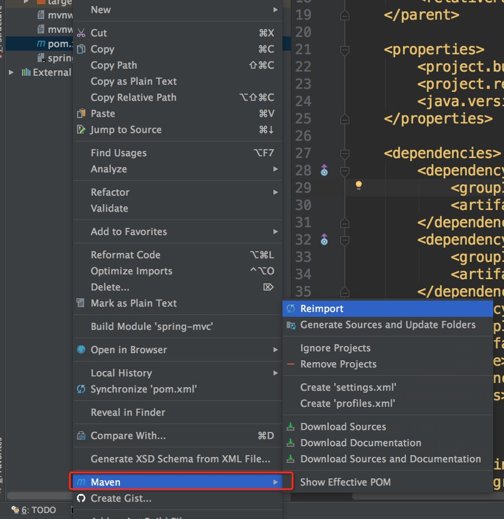 

导入成功，我们可以 在`Extenrnal Libraries`中找到这两个依赖如图：

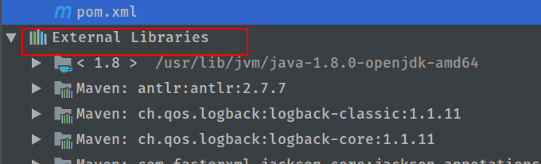
 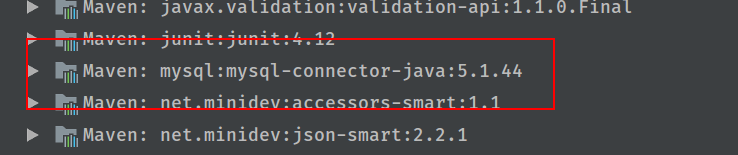 
 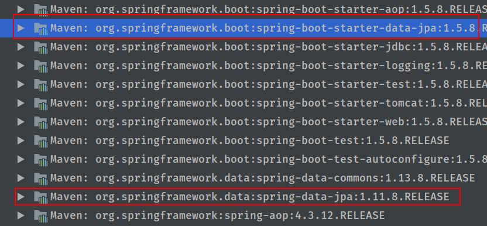 

### 测试

点击右上角启动按钮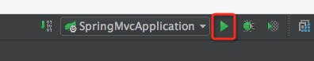 ，查看`IDEA`的控制台，得到以下错误提示：

```
***************************
APPLICATION FAILED TO START
***************************

Description:

Cannot determine embedded database driver class for database type NONE
```

中文翻译为：

```
***************************
应用程序启动失败
***************************

描述：
无法确定为类型为NONE的数据库嵌入数据库驱动类
```

是的，正如我们翻译后看到的信息一样，我们虽然在`pom.xml`加入`mysql`模块，但却并没有告诉`SpringMVC`我们在本项目中需要使用`mysql`数据库。
这就像学校偷偷的盖了一个游泳馆，但却没有告诉全校的学生游泳馆已经可以使用了。此时，你给学生下达去游泳的指令，他们当然不知道应该去哪里游泳了。
在`SpringMVC`中，要想成功的与`mysql`数据库连接，我们还需要配置一些数据库连接信息。

#### 配置mysql

在`SpringMVC`中，项目的配置文件位于`main/resources/application.properties`。下面，我们在`main`下创建`resources`文件夹，在`resources`文件下新建文件`application.properties`，文件目录如下图。

配置以下信息,让`SpringMVC`为我们自动创建数据表：

```
# 在项目初始化时，重新创建数据表
spring.jpa.hibernate.ddl-auto=create
# 指定连接的类型为mysql 连接的地址为：localhost 端口为3306 ，数据库为angularjs-springmvc
spring.datasource.url=jdbc:mysql://localhost:3306/angularjs-springmvc
# 用户名为root
spring.datasource.username=root
# 密码为空
spring.datasource.password=
```

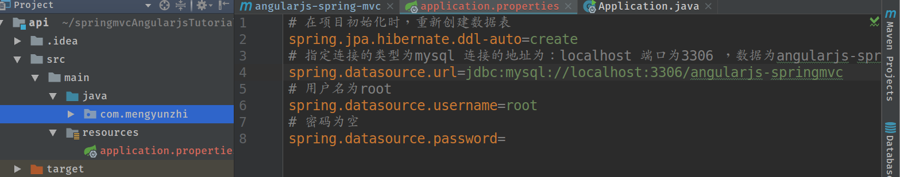 

注意：我们上面的信息是我们在3.1.2节配置数据库时所设置的。

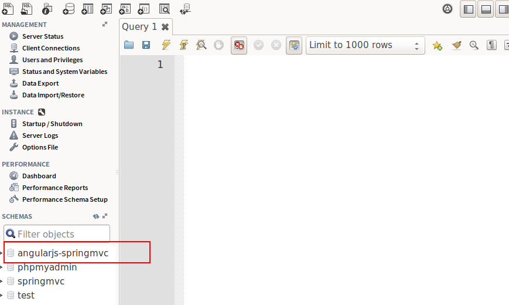 

此时，我们再次启动项目，在`mysql`服务启动的前提下，将得到启动成功的提示:

```
2017-10-30 17:04:50.874  INFO 5880 --- [           main] s.b.c.e.t.TomcatEmbeddedServletContainer : Tomcat started on port(s): 8080 (http)
2017-10-30 17:04:50.877  INFO 5880 --- [           main] com.mengyunzhi.Application               : Started Application in 4.667 seconds (JVM running for 5.663)
```

如果你不小心忘记了启动`mysql`，那么将得到以下错误：

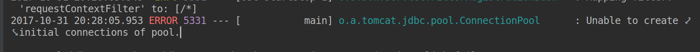 

此时，只需要启动`mysql`服务即可。

> 参考官方文档[https://spring.io/guides/gs/accessing-data-mysql/](https://spring.io/guides/gs/accessing-data-mysql/) 

### 新建数据表

`SpringMVC`中集成了`hibernate`框架，所以在`SrpingMVC`中有关系型数据库的部分，我们完全可以参考`hibernate`的开发文档。`hibernate`为我们提供了这样一个功能：将带有相关注解的`java`类自动与数据表进行关联。从而使我们可以完全的使用`java`代码来定义数据表。这样的做的优点当然很多，对于我们而言，我们再也不需要为了数据表不统一造成的各种莫名`BUG`而烦恼了。

> 通过`JDK 5.0`注解或`XML`描述对象－关系表的映射关系，并将运行起的实体对象持久化到数据库中----这就是`JPA(Java Persistence API)`。[http://baike.baidu.com/item/JPA](http://baike.baidu.com/item/JPA) 

#### 新建数据表

我们新建`repository`包，并在该包中，新建`Teacher`类。 

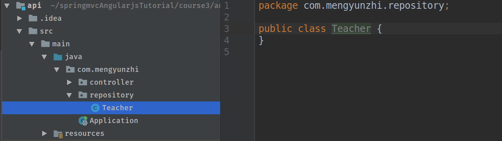 

然后：
-	使用`@Entity`来说明该类对应一个数据表,数据表的名字与类名相同。
-	使用`@Id`来说明：此字段是该表的主键。
-	使用`@GeneratedValue(strategy = GenerationType.AUTO)`来说明：该主键的生成策略为自动，对应`MySQL`的属性为`Auto increment`

> 之所以要将上述3个注解单独拿出来，是因为我们要常与它们打交道。每新建一个实体，上述的操作都是必须的。

```java
package com.mengyunzhi.repository;

import javax.persistence.Entity;
import javax.persistence.GeneratedValue;
import javax.persistence.GenerationType;
import javax.persistence.Id;

/**
 * Created by shu on 17/10/31
 */
// 使用@Entity 来说明该类对应一个数据表
@Entity
public class Teacher {
    //    声明主键
    @Id
    //    声明主键生成策略为 自动
    @GeneratedValue(strategy = GenerationType.AUTO)
    private Long id;
}
```

#### 测试

我们再次点击`IDEA`的`Run`按钮，来重新启动项目。项目成功启动后，我们将得到一个`Teacher`表，这个表中，有一个字段`id`，该字段为表的主键，该字段被设置了`Auto increment`属性。如下： 

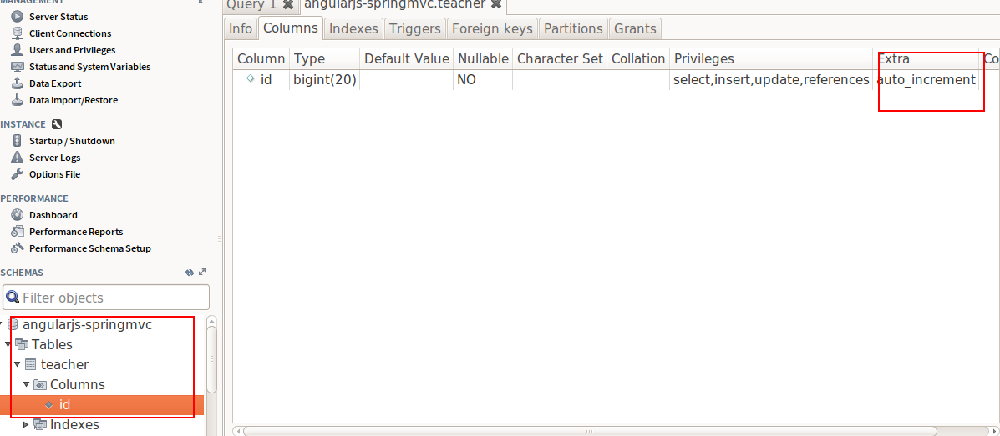 

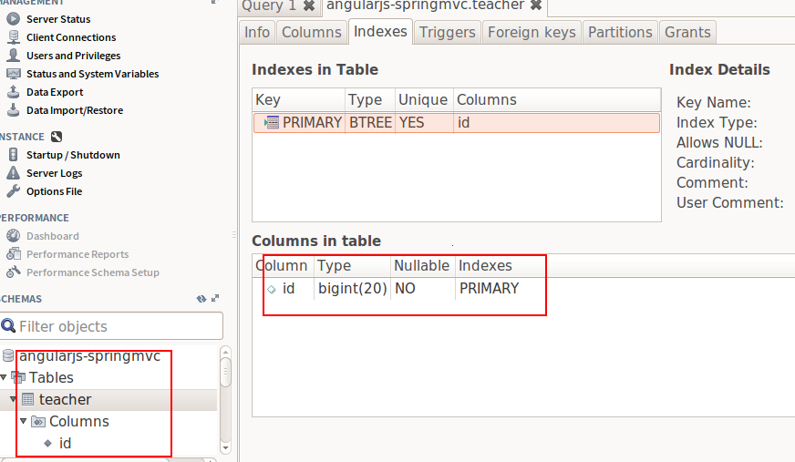 

#### 增加其它属性

参考`ER`图

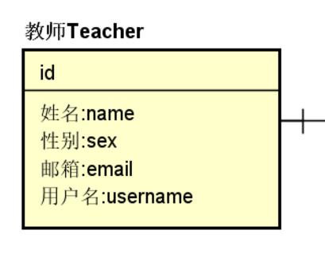 

相关代码如下：

```java
package com.mengyunzhi.repository;

import javax.persistence.Entity;
import javax.persistence.GeneratedValue;
import javax.persistence.GenerationType;
import javax.persistence.Id;

/**
 * Created by shu on 17/10/31
 */
// 使用@Entity 来说明该类对应一个数据表
@Entity
public class Teacher {
    //    声明主键
    @Id
    //    声明主键生成策略为 自动
    @GeneratedValue(strategy = GenerationType.AUTO)
    private Long id;

    private String name;    // 姓名

    private Boolean sex;    // 性别 0,男；1,女；

    private String email;   // 邮箱

    private String username;    // 用户名
}
```

然后我们重新启动项目，将得到如下数据表: 

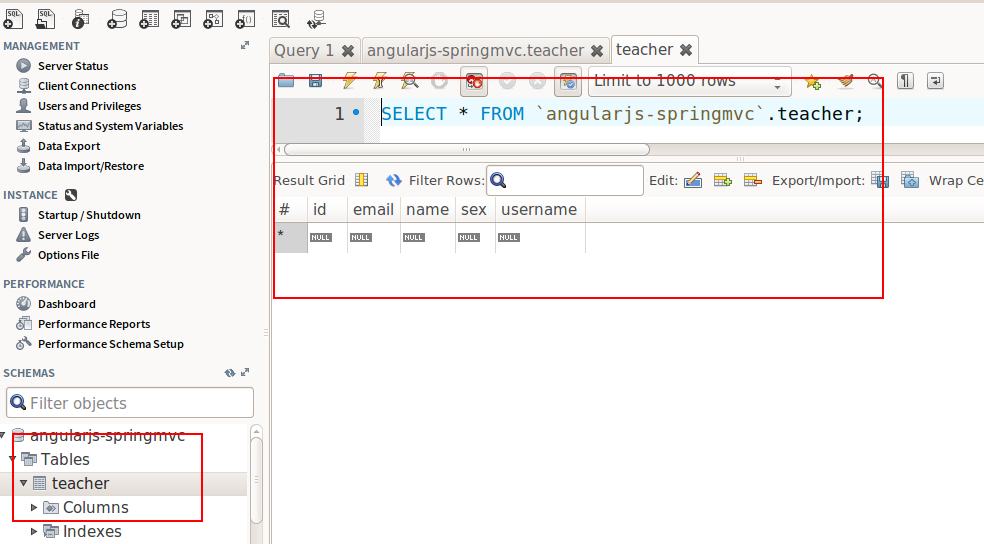 

最后，按照`jpa`的规范，我们增加`set\get`函数，构造函数及`toString`函数。

> 你可以使用`alt+insert`来快速生成上面所提到的函数。

```java
package com.mengyunzhi.repository;

import javax.persistence.Entity;
import javax.persistence.GeneratedValue;
import javax.persistence.GenerationType;
import javax.persistence.Id;

/**
 * Created by shu on 17/10/31
 */
// 使用@Entity 来说明该类对应一个数据表
@Entity
public class Teacher {
    //    声明主键
    @Id
    //    声明主键生成策略为 自动
    @GeneratedValue(strategy = GenerationType.AUTO)
    private Long id;

    private String name;    // 姓名

    private Boolean sex;    // 性别 0,男；1,女；

    private String email;   // 邮箱

    private String username;    // 用户名

    @Override
    public String toString() {
        return "Teacher{" +
                "id=" + id +
                ", name='" + name + '\'' +
                ", sex=" + sex +
                ", email='" + email + '\'' +
                ", username='" + username + '\'' +
                '}';
    }

    public Teacher() {
    
    }

    public Long getId() {
        return id;
    }

    public void setId(Long id) {
        this.id = id;
    }

    public String getName() {
        return name;
    }

    public void setName(String name) {
        this.name = name;
    }

    public Boolean getSex() {
        return sex;
    }

    public void setSex(Boolean sex) {
        this.sex = sex;
    }

    public String getEmail() {
        return email;
    }

    public void setEmail(String email) {
        this.email = email;
    }

    public String getUsername() {
        return username;
    }

    public void setUsername(String username) {
        this.username = username;
    }
}
```

#### 测试

打开`workbench `查看最新生成的数据表。

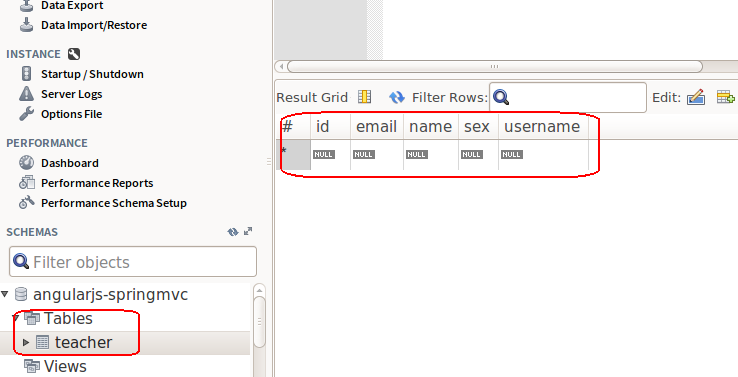 


> 官方文档：[java与数据表类型对照](https://docs.jboss.org/hibernate/orm/current/userguide/html_single/Hibernate_User_Guide.html#basic-provided) 

执行`git checkout  3.2.4-api-new-table`命令后，你本机的代码，已经和我们本节教程一致了。

---

作者：朱晨澍

