# 3.2.5 操作数据表

上一小节中，我们在后台的`Repository`中新建了`Teacher`实体，并在`SpringMVC`中集成的`Hibernate`框架的帮助下成功映射到`Teacher`数据表，本节中，我们学习如何对数据表操作。

## 仓库接口

操作数据表无非增删改查，而这些，`SpringMVC`已经为我们写好了。

在`Repository`包上右击，`New`，之后选择`Java Class`。

然后在弹出的对话框中，`Name`一栏填写名称`TeacherRepository`，下面的`Kind`(类型)我们选择`Interface`(接口)。

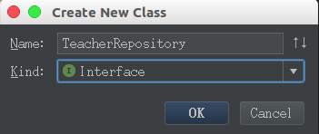

之后`IDEA`就为我们创建了这样一个接口文件。

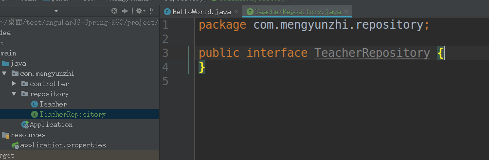

当然，如果类型选成了`Class`类也没关系，我们直接在文件中把`class`改成`interface`即可。

我们在`TeacherRepository`中写如下代码：

```java
package com.mengyunzhi.repository;

import org.springframework.data.repository.CrudRepository;
/**
 * 教师数据操作接口
 * 继承SpringMVC中提供的增删改查接口
 */
public interface TeacherRepository extends CrudRepository<Teacher, Long> {

}
```

这里我们的`TeacherRepository`继承了`CrudRepository`接口，这是框架为我们写好的接口，实现了基本的增删改查功能。

```java
/**
 * 教师数据操作接口
 * 继承SpringMVC中提供的增删改查接口
 */
public interface TeacherRepository extends CrudRepository<Teacher, Long>
```

尖括号内为泛型，第一个为实体名，第二个为主键类型。如果你不了解`Java`泛型的话，可以参考这篇博客[Java泛型详解](https://www.ziwenxie.site/2017/03/01/java-generic/)

## 单元测试

测试是保证软件开发质量的重要一环。而想办法测试自己写的每一个函数，每个类是否正确。则是测试的开始。我们把这种用来测试类与函数是否实现了我们的预期功能的测试叫做单元测试。

我们以前测试`ThinkPHP`开发的系统时，我们需要去网页上去点击，去看看自己写的方法是否有效，是测试的很多功能集成在一起会的表现，叫做集成测试。

下面，我们正式步入单元测试的殿堂，让我们使用优美可靠的代码来验证我们的程序开发。

打开`TeacherRepository`文件，把光标放在接口名附近，左上角会出现小灯泡，点击，选择`Create Test`。

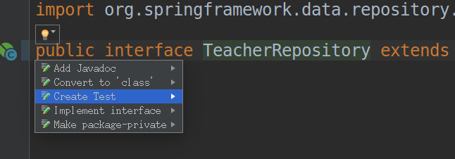

之后，`IDEA`就会帮我们在`test`的统计目录下建立`TeacherRepositoryTest`测试文件。

然后，在测试类上添加注解。

```java
// 这两条注解声明测试基于SpringBoot
@SpringBootTest
@RunWith(SpringRunner.class)
public class TeacherRepositoryTest {

}
```

`@SpringBootTest`和`@RunWith(SpringRunner.class)`两个注解声明了测试的环境为`SpringBoot`。

因为本测试文件是要测试`TeacherRepository`这个接口提供的方法是否正确，以我们传统的思路，用这个接口的实现类去创建对象，然后调用方法去测试。

`SpringMVC`给我们提供了更加简便的方法，`@Autowired`注解。

```java
// 这两条注解声明测试基于SpringBoot
@SpringBootTest
@RunWith(SpringRunner.class)
public class TeacherRepositoryTest {

    // 自动装配TeacherRepository的对象
    @Autowired
    private TeacherRepository teacherRepository;
}
```

我们可以通过`@Autowired`注解直接装配进一个`TeacherRepository`接口实现类的对象，简化了我们新建对象的流程。

```java
// 这两条注解声明测试基于SpringBoot
@RunWith(SpringRunner.class)
@SpringBootTest
public class TeacherRepositoryTest {

    // 自动装配TeacherRepository的对象
    @Autowired
    private TeacherRepository teacherRepository;

    // @Test声明这个方法是一个单元测试方法
    @Test
    public void saveTest() {
        teacherRepository.save(new Teacher());
    }
}
```

这里我们直接调用`teacherRepository`中的`save`方法去保存一个新建的`Teacher`类的对象，如果保存错误，框架会直接抛出异常，所以，如果通过该测试，就证明该接口有效。

点击方法左侧的绿三角，选择`Run 'saveTest()'`，运行这个单元测试方法。

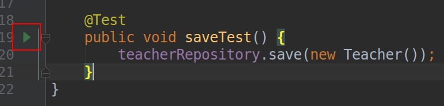

运行完成后，我们看到提示信息：`1 test passed`(一个测试通过)，表示我们所写的仓库接口通过了单元测试，没有问题。

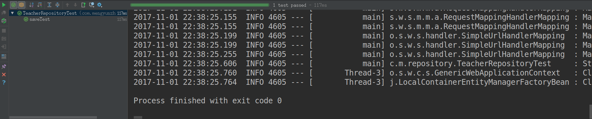

*提示：如果没有通过测试的话，去看看是否是忘记开启`xampp`造成的数据库连接问题。*

## 数据初始化

按照流程，已经建立好了操作数据库的接口，我们就可以用这个接口在数据库增加数据了，但是本节的重点是读取数据，为了大家更清楚“读取数据”的流程，所以我们在后面添加数据的章节时再去学习如何利用代码添加，这里，我们在数据库中手动添加数据。

我们要展示的效果就是张三、李四两条数据，我们打开`Workbench`，打开教师表，手动添加这两条数据。

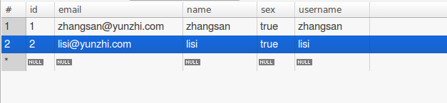

```
id email               name     sex  username
1  zhangsan@yunzhi.com zhangsan true zhangsan
2  lisi@yunzhi.com     lisi     true lisi
```

点击右下角`Apply`。


会弹出对话框，内容是要执行两条`SQL`语句，点击右下角`Apply`。

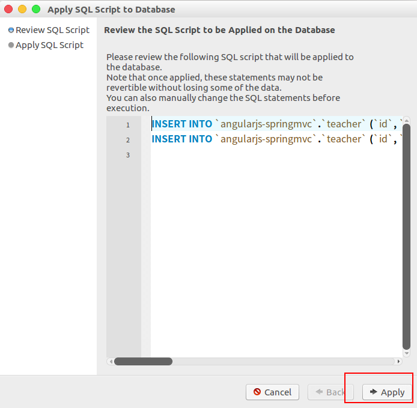

执行之后会出现如下提示：`SQL script was successfully applied to the database.`(`SQL`脚本已成功应用于数据库)。

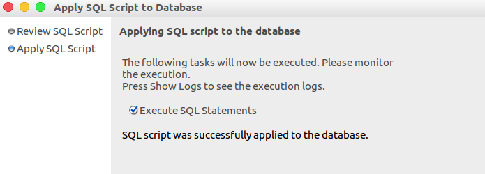

## 修改配置

上一小节中，我们对`resources`目录下的`application.properties`文件进行了如下配置：

```
# 在项目初始化时，重新创建数据表
spring.jpa.hibernate.ddl-auto=create
# 指定连接的类型为mysql 连接的地址为：localhost 端口为3306 ，数据库为angularjs-springmvc
spring.datasource.url=jdbc:mysql://localhost:3306/angularjs-springmvc
# 用户名为root
spring.datasource.username=root
# 密码为空
spring.datasource.password=
```

我们之前配置`spring.jpa.hibernate.ddl-auto=create`，每次启动项目时重新创建数据表，换句话说，每次启动项目后，我们之前手动添加的数据就消失了。

所以我们将`create`(创建)改为`update`(更新)。

```
# 在项目初始化时，更新数据表
spring.jpa.hibernate.ddl-auto=update
# 指定连接的类型为mysql 连接的地址为：localhost 端口为3306 ，数据库为angularjs-springmvc
spring.datasource.url=jdbc:mysql://localhost:3306/angularjs-springmvc
# 用户名为root
spring.datasource.username=root
# 密码为空
spring.datasource.password=
```

## 完善测试

通过上面的学习，我们已经初步认识了单元测试，而本节中，我们需要从数据库中获取数据，并发送到前台显示，所以我们要完善我们的测试保证我们从数据库中获取到的数据是正确的。

我们在测试代码中再写一个`findAllTest`测试方法：

```java
// @Test声明这个方法是一个单元测试方法
@Test
public void findAllTest() {
    // 调用teacherRepository的findAll方法，并将返回值赋给teachers。
    List<Teacher> teachers = teacherRepository.findAll();
}
```

我们希望的是调用`teacherRepository`的`findAll`方法，并将返回值赋给`List<Teacher>`类型的`teachers`。

但是这里，`IDEA`将这行代码标红，表示我们写的这行代码有问题。

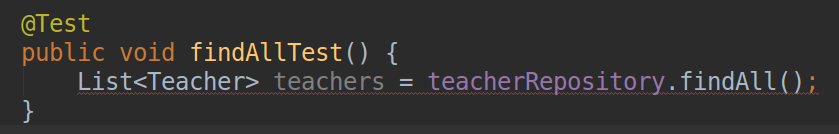

`findAll`方法的返回值类型为`Iterable<Teacher>`，而我们用`List<Teacher> `类型的`teachers`去接收，就会提示错误。

我们需要进行强制类型转换。

```java
// @Test声明这个方法是一个单元测试方法
@Test
public void findAllTest() {
    // 调用teacherRepository的findAll方法，并将返回值转换为List类型后赋值给teachers。
    List<Teacher> teachers = (List<Teacher>) teacherRepository.findAll();
}
```

继续跟着思路走，我们获取到了`findAll`返回来的数据列表，我们需要验证列表中是否是两条数据。

同样，已经有现成的类供我们使用，我们只需导入即可。

```java
// 静态导入断言类
import static org.assertj.core.api.Assertions.assertThat;
```

之后我们加入断言，来完善我们的测试。

```java
package com.mengyunzhi.repository;

import org.junit.Test;
import org.junit.runner.RunWith;
import org.springframework.beans.factory.annotation.Autowired;
import org.springframework.boot.test.context.SpringBootTest;
import org.springframework.test.context.junit4.SpringRunner;

import java.util.List;

// 静态导入断言类
import static org.assertj.core.api.Assertions.assertThat;

// 这两条注解声明测试基于SpringBoot
@SpringBootTest
@RunWith(SpringRunner.class)
public class TeacherRepositoryTest {

    // 自动装配TeacherRepository的对象
    @Autowired
    private TeacherRepository teacherRepository;

    // @Test声明这个方法是一个单元测试方法
    @Test
    public void findAllTest() {
        // 调用teacherRepository的findAll方法，并将返回值转换为List类型后赋值给teachers。
        List<Teacher> teachers = (List<Teacher>) teacherRepository.findAll();
        // 断言teachers的长度为2
        assertThat(teachers.size()).isEqualTo(2);
    }
}
```

断言：我们断定。`assertThat(teachers.size()).isEqualTo(2);` -> 我们断定`teachers`的长度为2。

如果最终的结果和我们断定的不一样，我们便会得到一个错误。

```java
assertThat(teachers.size()).isEqualTo(2);
```

最后，我们运行测试，测试通过。

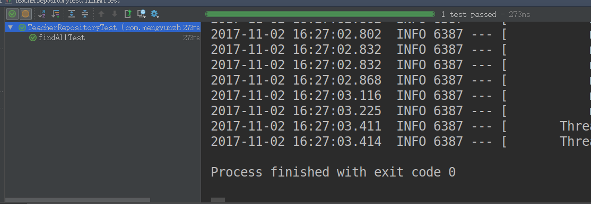

**提示**

如果单元测试没有通过，不要着急。我们去控制台看打印出来的错误信息。

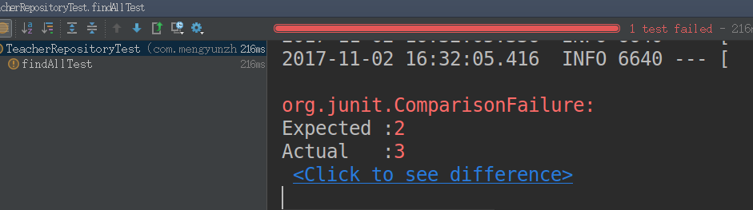

如上图，测试未通过。这里给出错误信息：

```
Expected :2
Actual   :3
```

期待的是`2`，但是实际是`3`，我们就要去数据库中看看我们是不是多添加了一条数据。

## 参考代码

输入以下命令即可切换到本小节示例代码标签：

```
git checkout -f 3.2.5-api-link-table-and-data-init
```

*作者：张喜硕*