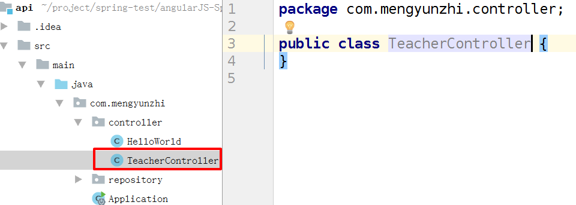
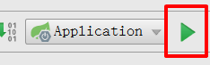
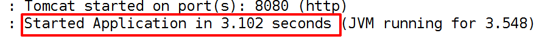
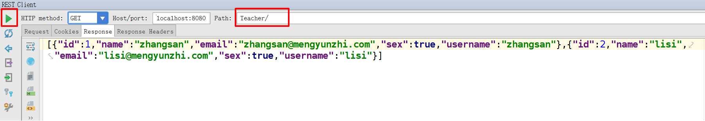
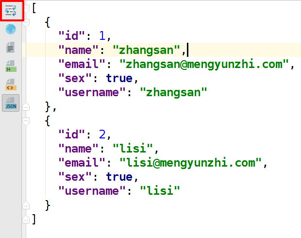
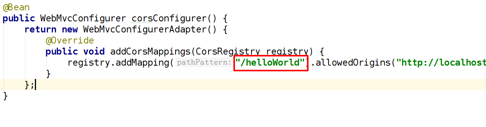
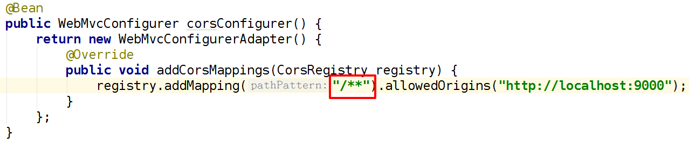

# 建立教师控制器

有了数据表，我们就可以开始建立教师控制器了。

## 新建控制器

在 `Controller` 文件夹下，右键，新建一个`TeacherController` 类。



自动载入 `TeacherRepository`

```
...
@RestController
@RequestMapping("/Teacher")
public class TeacherController {
    // Autowired注解：自动加载Spring为我们自动实例化的TeacherRepository接口对象
    @Autowired
    private TeacherRepository teacherRepository;
    ...
```

添加 `getAll` 方法，并设置路由

```
    ...
    // GetMapping注解：设置路由，表示该方法只接受 get 请求
    @GetMapping("/")
    public List<Teacher> getAll() {
    }
    ...
```

直接通过 `teacherRepository` 中的 `findAll` 方法获取所有的教师信息。

```
...
    // GetMapping注解：设置路由，表示该方法只接受 get 请求
    @GetMapping("/")
    public List<Teacher> getAll() {
        List<Teacher> teachers = (List<Teacher>) teacherRepository.findAll();
        return teachers;
    }
    ...
```

由于我们的教师对象有多个，所以我们返回类型为 `List<>` 的对象数组。

最终代码如下：

```
package com.mengyunzhi.controller;

import com.mengyunzhi.repository.Teacher;
import com.mengyunzhi.repository.TeacherRepository;
import org.springframework.beans.factory.annotation.Autowired;
import org.springframework.web.bind.annotation.GetMapping;
import org.springframework.web.bind.annotation.RequestMapping;
import org.springframework.web.bind.annotation.RestController;

import java.util.List;

/**
 * 教师控制器
 * 2017-10-31
 * design by Poshichao
 */
// RestController注解：声明一个REST风格的控制器（支持前后台分离）
// RequestMapping注解：设置路由，将“/Teacher”映射到TeacherController（教师控制器）上
@RestController
@RequestMapping("/Teacher")
public class TeacherController {
    // Autowired注解：自动加载Spring为我们自动实例化的TeacherRepository接口对象
    @Autowired
    private TeacherRepository teacherRepository;

    // GetMapping注解：设置路由，表示该方法只接受 get 请求
    @GetMapping("/")
    public List<Teacher> getAll() {
        List<Teacher> teachers = (List<Teacher>) teacherRepository.findAll();
        return teachers;
    }
}
```   

## 测试

重新启动项目。



去看我们的控制台。



好，成功启动项目。

然后打开IDEA为我们提供的测试工具 `Test RESTful Web Service`。



将路径 `Path` 改为 `Teacher/`，点击左侧的绿色三角，运行一下。然后就看到我们数据库中教师的信息全部获取出来了。

作为一个编程人员，看到对象信息是这种样子的，肯定很不舒服。没关系，强大的IDEA早就想到了。



点左侧按钮，然后这才是我们想要的最终格式。

## 设置CORS

还记得我们在前面遇到的跨域的问题吗?我们在启动项 `Application` 做了跨域设置。



没错，我们是这样解决的。但是现在问题又来了，我们又新建了一个 `TeacherController` 控制器，有了新的路由 `/Teacher` ，而原来原来添加的 `addMapping` 依然映射到 `/helloWorld` 这个路由上。所以为了让它映射到我们新的路由，同时后面设置新路由时也不用再改一次，我们就将 `addMapping` 设置成 `/**`。



最后再重启一下项目，没有报错。

#### 查看示例代码

```bash
git checout -f 3.2.6-api-cotroller-cors-set
```

-----------------------

***作者：朴世超***