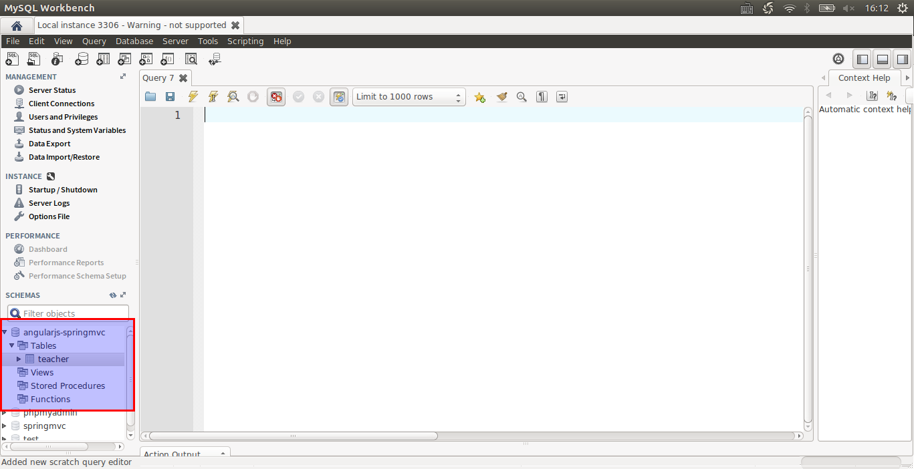
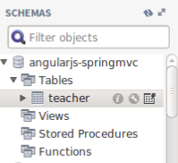
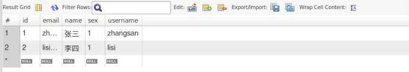
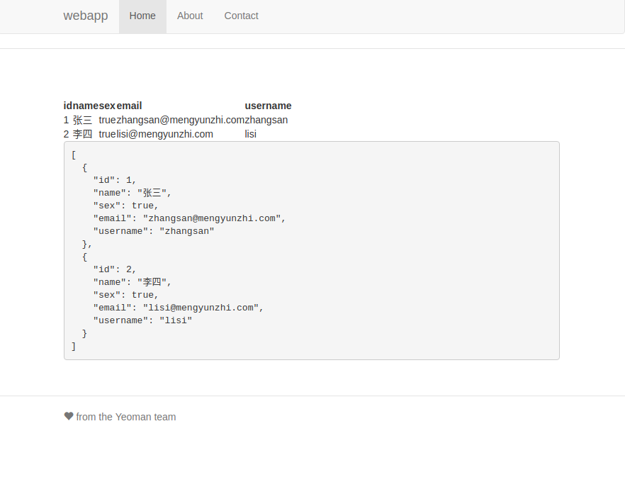
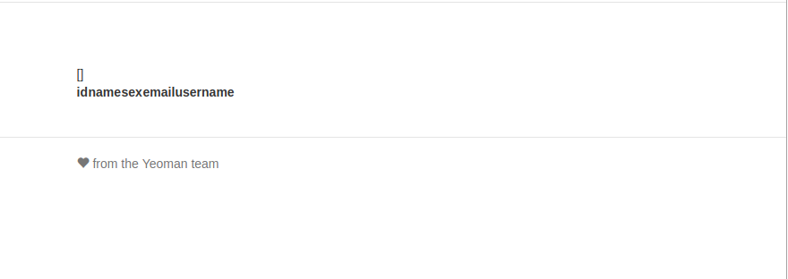

# 前台显示后台传入数据


## 浏览器显示传入数据

1.修改控制器中和v层代码

（1）前台controllers下main.js文件

```js
angular.module('webappApp')
  .controller('MainCtrl', function($scope, $http) {
  
    // 要修改部分
    var url = 'http://localhost:8080/Teacher/';
    $http.get(url)
      .then(function success(response) {
        $scope.data = response.data;
      }, function error(response) {
        console.error('url:' + url, response);
      });
  });
```

（2）前台views下main.html文件

```html
<div class="row marketing">
{{data}}
  <table >
    <tr>
      <th>id</th>
      <th>name</th>
      <th>sex</th>
      <th>email</th>
      <th>username</th>
    </tr>
    <tr ng-repeat="_data in data">
      <td>{{_data.id}}</td>
      <td>{{_data.name}}</td>
      <td>{{_data.sex}}</td>
      <td>{{_data.email}}</td>
      <td>{{_data.username}}</td>
    </tr>
  </table>
</div>
```


（3）后台controller文件夹下TeacherController文件

```java
package com.mengyunzhi.controller;

import com.mengyunzhi.repository.Teacher;
import com.mengyunzhi.repository.TeacherRepository;
import org.springframework.beans.factory.annotation.Autowired;
import org.springframework.web.bind.annotation.GetMapping;
import org.springframework.web.bind.annotation.RequestMapping;
import org.springframework.web.bind.annotation.RestController;


import java.util.List;

@RestController
@RequestMapping("/Teacher")  // 第一部分
public class TeacherController {

    @Autowired
    private TeacherRepository teacherRepository;

    @GetMapping("/") // 第二部分
    public List<Teacher> getAll() {
        List<Teacher> teachers = (List<Teacher>) teacherRepository.findAll();
        return teachers;
    }

}
```
（4）修改Application文件

```java
package com.mengyunzhi;

import org.springframework.boot.SpringApplication;
import org.springframework.boot.autoconfigure.SpringBootApplication;
import org.springframework.context.annotation.Bean;
import org.springframework.web.servlet.config.annotation.CorsRegistry;
import org.springframework.web.servlet.config.annotation.WebMvcConfigurer;
import org.springframework.web.servlet.config.annotation.WebMvcConfigurerAdapter;

@SpringBootApplication
public class Application {
    public static void main(String[] args) {
        SpringApplication.run(Application.class, args);
    }
    @Bean
    public WebMvcConfigurer corsConfigurer() {
        return new WebMvcConfigurerAdapter() {
            @Override
            public void addCorsMappings(CorsRegistry registry) {
                registry.addMapping("/Teacher/").allowedOrigins("http://localhost:9000");
            }
        };
    }
}
```

主要改动：

```java
registry.addMapping("/Teacher/").allowedOrigins("http://localhost:9000");
```

也可以使用：
```java
registry.addMapping("/**").allowedOrigins("http://localhost:9000");
```


注意: 保证前台控制器和后台控制器对应url一致。


---

2.在数据库手动添加数据

- 第一步：打开workbench



- 第二步：在页面左下角部分有一个teacher表，鼠标点击第三个标志，进行编辑操作

 


- 第三步：添加2条数据

 

---

3.显示数据

 


## 引用boostrap样式

如果你觉得这个页面很丑，这里我们可以引用bootstrap样式，厉害的是我们在用yeoman搭建项目的时候，它就已经帮我们把bootstrap引入了进来。我们只需要会用它就行。

我们只需给table标签加一个样式即可，当然你可以根据自己的喜好选择不同的样式：

```html
<div class="row marketing">
{{data}}
  <table class="table">
    <tr>
      <th>id</th>
      <th>name</th>
      <th>sex</th>
      <th>email</th>
      <th>username</th>
    </tr>
    <tr ng-repeat="_data in data">
      <td>{{_data.id}}</td>
      <td>{{_data.name}}</td>
      <td>{{_data.sex}}</td>
      <td>{{_data.email}}</td>
      <td>{{_data.username}}</td>
    </tr>
  </table>
</div>
```

修改后效果如下：

 


我还记得老师给我们的建议：若想成为一个bootstrap大神，你只需要一天20分钟的时间来浏览bootstrap的样式。[http://v3.bootcss.com/](http://v3.bootcss.com/) 

>简单的事情重复做，你就是成功者。    
                                             ——潘老师


在命令行中输入获得示例代码：
```git
git checkout 3.2.7-frount-to-back
```

---
*作者：陈志高*


