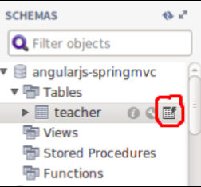

# 前台显示后台传入数据


## 实现前后台连接


1.前台```controllers```下```main.js```文件改为如下代码：

```js
angular.module('testApp')
  .controller('MainCtrl', function($scope, $http) {
    var url = 'http://localhost:8080/Teacher/';
    $http.get(url)
      .then(function success(response) {
        $scope.data = response.data;
      }, function error(response) {
        console.error('url:' + url, response);
      });
  });
```
2.对v层代码进行一下修改
```html
<div class="row marketing">
{{data}}
  <table >
    <tr>
      <th>id</th>
      <th>name</th>
      <th>sex</th>
      <th>email</th>
      <th>username</th>
    </tr>
    <tr ng-repeat="_data in data">
      <td>{{_data.id}}</td>
      <td>{{_data.name}}</td>
      <td>{{_data.sex}}</td>
      <td>{{_data.email}}</td>
      <td>{{_data.username}}</td>
    </tr>
  </table>
</div>

```
3.未添加数据时页面显示


## 在数据库手动添加待检测数据


- 第一步：打开workbench


- 第二步：在页面左下角部分有一个teacher表，鼠标点击第三个标志，进行编辑操作

 


- 第三步：添加2条数据

 

---


添加数据后显示结果：


## 引用boostrap样式

如果你觉得这个页面很丑，这里我们可以引用bootstrap样式，厉害的是我们在用yeoman搭建项目的时候，它就已经帮我们把bootstrap引入了进来。我们只需要会用它就行。

我们只需给table标签加一个样式即可，当然你可以根据自己的喜好选择不同的样式：

```html
<div class="row marketing">
  <pre>{{ data | json }}</pre>
  <table class="table">
    <tr>
      <th>id</th>
      <th>name</th>
      <th>sex</th>
      <th>email</th>
      <th>username</th>
    </tr>
    <tr ng-repeat="_data in data">
      <td>{{_data.id}}</td>
      <td>{{_data.name}}</td>
      <td>{{_data.sex}}</td>
      <td>{{_data.email}}</td>
      <td>{{_data.username}}</td>
    </tr>
  </table>
</div>
```

修改后效果如下：

 


我还记得老师给我们的建议：若想成为一个bootstrap大神，你只需要一天20分钟的时间来浏览bootstrap的样式。[http://v3.bootcss.com/](http://v3.bootcss.com/) 

这里引用潘老师经常说的一句话：

>简单的事情重复做，你就是专家；重复的事情认真做，你就是赢家。


在命令行中输入获得示例代码：
```git
git checkout -f  3.2.7-frount-to-back
```

---
*作者：陈志高*


