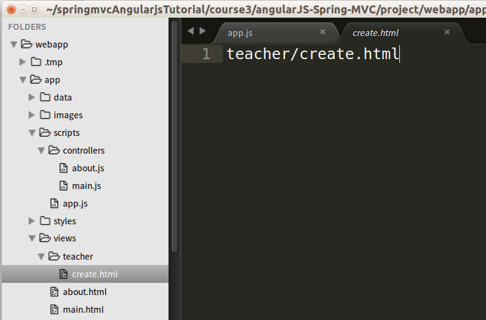
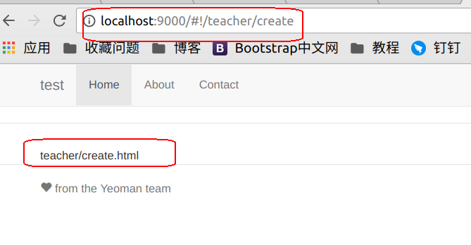

## 3.3.1 建立前台`v`层路由

本章我们要实现学生信息的添加功能，为此在前台我们要新建一个视图和控制器实现我们的信息添加，当然为了能通过`URL`找到我们的视图，我们要建立一个路由，然后将界面的`c`层与`v`层的信息加入其中。这样我们就能通过`URL`访问到相应的视图和控制器。本节中我们主要讲一下如何为视图配置路由。

我们的路由配置文件为`app.js`,文件所在路径为`webapp/app/scripts/app.js`,部分代码如下：

```javascript
.config(function ($routeProvider) {
    $routeProvider
      .when('/', {
        templateUrl: 'views/main.html',
        controller: 'MainCtrl',
        controllerAs: 'main'
      })
      .when('/about', {
        templateUrl: 'views/about.html',
        controller: 'AboutCtrl',
        controllerAs: 'about'
      })
      .otherwise({
        redirectTo: '/'
      });
  });
```
`$routeProvider `用来定义路由表，我们会用到里面的`when`和`otherwise`两个方法。在本节中我们主要讲`when`方法，然后用`when`方法创建一个我们自己的路由。
`when`方法能够接收两个参数，第一个参数是路由路径，这个路径会与`URL`中的值进行匹配，如果没有任何一个when方法匹配到，那么将会执行otherwise方法。第二个参数是配置对象，在这里我们用到了`templateUrl`这个参数。

`templateUrl` 的值是视图的路径，AngularJS会拿该路径下的Html模板来渲染。

下面我们来新建一个视图并未它配置路由：

在`views`文件夹下建一个`teacher`文件夹，在`teacher`夹下创建我们的视图文件`create.html`并写入`teacher/create.html`如下图。

 

下面为我们新加的界面配置路由信息。
通常代码的书写顺序为：

1.先写一个`when`方法
```javascript
.when()
```

2.为`when`方法添加两个参数,第一个参数为路由路径，第二个参数为配置对象，在配置对象中通过参数`templateUrl`写入视图的路径。

```javascript
.when('/teacher/create', { templateUrl: 'views/teacher/create.html' })
```

将上面的代码加入到路由配置文件`app.js`中后代码如下。

```javascropt
.when('/', {
        templateUrl: 'views/main.html',
        controller: 'MainCtrl',
        controllerAs: 'main'
      })
      .when('/about', {
        templateUrl: 'views/about.html',
        controller: 'AboutCtrl',
        controllerAs: 'about'
      })
      .when('/teacher/create', {                  
        templateUrl: 'views/teacher/create.html'  
      })
      .otherwise({
        redirectTo: '/'
      });
```

### 测试

在地址栏中输入我们新建的`ur`l信息`http://localhost:9000/#!/teacher/create`，看我们显示的信息是否是我们在`create.html`中写入的信息。

 

如图则表示我们的路由添加成功。

---

作者：朱晨澍