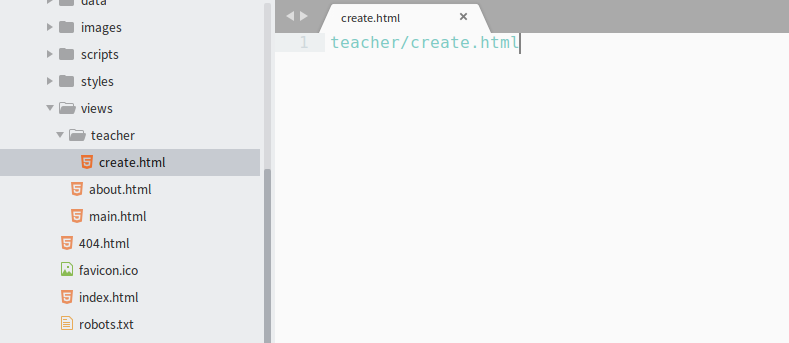
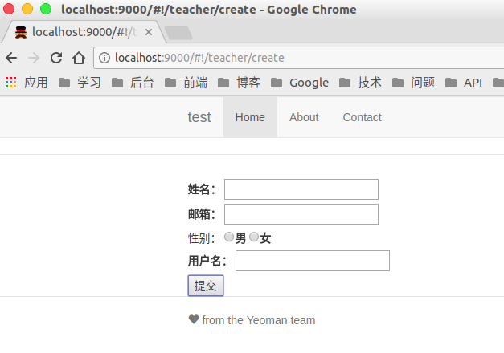

# 3.3.2 V层初始化

本节，我们的主要任务是完成前台新建教师页面的初始化。

## form表单

提交数据，我们需要一个`form`表单，打开我们上一小节中新建的`views/teacher/create.html`文件。



删除原来的代码，替换为如下代码：

```html
<form>
    <label>姓名：
        <input type="text" name="name">
    </label>
    <br>
    <label>邮箱：
        <input type="email" name="email">
    </label>
    <br>
    性别：
    <label>
        <input type="radio" name="sex" value="0">男
    </label>
    <label>
        <input type="radio" name="sex" value="1">女
    </label>
    <br>
    <label>用户名：
        <input type="text" name="username">
    </label>
    <br>
    <button>提交</button>
</form>
```

访问`http://localhost:9000/#!/teacher/create`，一个基本的用于保存的`form`表单就出来了。



## submit

表单提交时，我们使用`ng-submit`去触发表单提交时的方法。我们对`form`进行如下修改：

```html
<form ng-submit="submit()">

</form>
```

当表单提交时(点击按钮)，就会触发`C`层中的`submit`方法。

`AngularJS`官网有对`ng-submit`的介绍，[ngSubmit-AngularJS](https://docs.angularjs.org/api/ng/directive/ngSubmit)