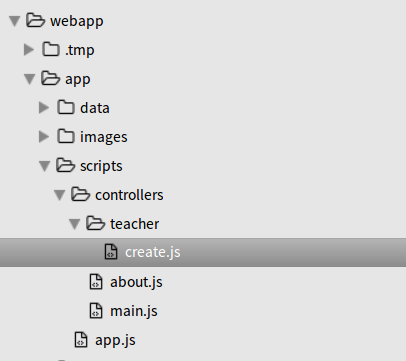
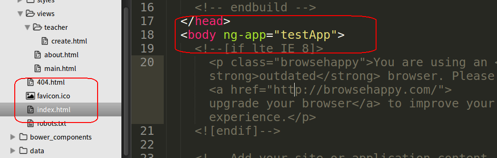
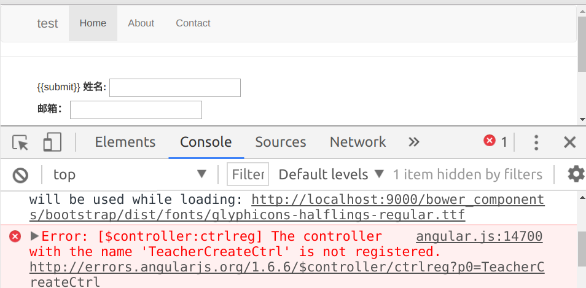

## 3.3.3前台c层添加路由

在3.3.1节中，我们讲述了如何为前台的`v`层添加路由，下面我们要为我们新建的`v`层添加`c`层，但是我们如何将我们的`v`层与`c`层匹配起来呢，在`angularjs`中我们将他们的匹配信息写在路由中。本节中我们将讲述如何为`c`层添加路由。

打开我们的路由配置文件`app.js`

```javascript
.when('/', {
        templateUrl: 'views/main.html',
        controller: 'MainCtrl',
        controllerAs: 'main'
      })
      .when('/about/:id', {
        templateUrl: 'views/about.html',
        controller: 'AboutCtrl',
        controllerAs: 'about'
      })
      .when('/teacher/create', {
        templateUrl: 'views/teacher/create.html'
      })
      .otherwise({
        redirectTo: '/'
      });
```

我们将在`when`方法中的第二个参数配置对象里面,添加属性`controller`来配置相应的`c`层信息。

`controller` 该属性的值是我们的控制器名称，控制器会与路由所指定的`v`层关联在一起，并且转到该路径时都会执行一次控制器中的内容。 

接下来我们先创建一个控制器，本教程中我们的控制器放置在`webapp/app/scripts/controllers`路径下。在该路径下新建文件夹`teacher`,将`c`层文件`create.js`放置在该文件夹里面，如下图。

 

然后开始创建我们的控制器代码：

1.在创建控制器时，我们首先要定义一下我们的我们的控制器属于那个模块，

`angular.module('testApp')`为AngularJS 的模块定义，`testApp`为我们的模块名称。在`index.html`有定义。

 

2.定义好模块后，我们要开始写控制器了，`.controller()`是控制器的方法定义，`controller()`方法有两个参数，第一个代表我们的控制器名称，在这里我们的控制器名称为`TeacherCreateCtrl`，第二个参数为我们的控制器的实现函数，在这里我们只用定义函数，还不用在里面写具体的实现方法。

`.controller('TeacherCreateCtrl', function() {});`

接着将上面的代码整理格式后写入`create.js`中

```javascropt
angular.module('testApp')
  .controller('TeacherCreateCtrl', function() {
    
  });
```

接着将我们写好的控制器写入我们的路由中。

前面提到，我们在配置对象里面，使用`controller`属性来配置`c`层路由。

`controller: 'TeacherCreateCtrl'`

将上述代码加入到我要关联的视图所在的路由，后代码如下

```javascript
.when('/', {
        templateUrl: 'views/main.html',
        controller: 'MainCtrl',
        controllerAs: 'main'
      })
      .when('/about/:id', {
        templateUrl: 'views/about.html',
        controller: 'AboutCtrl',
        controllerAs: 'about'
      })
      .when('/teacher/create', {
        templateUrl: 'views/teacher/create.html',
        controller: 'TeacherCreateCtrl'
      })
      .otherwise({
        redirectTo: '/'
      });
```

不要忘记在主视图界面`index.html`中引入我们新建的`c`层`js`文件，如下代码。

`<script src="scripts/controllers/teacher/create.js"></script>`

不然浏览器会报错如下。

 

如果没出现错误，至此为止，我们的c层添加路由完毕。

---

作者：朱晨澍