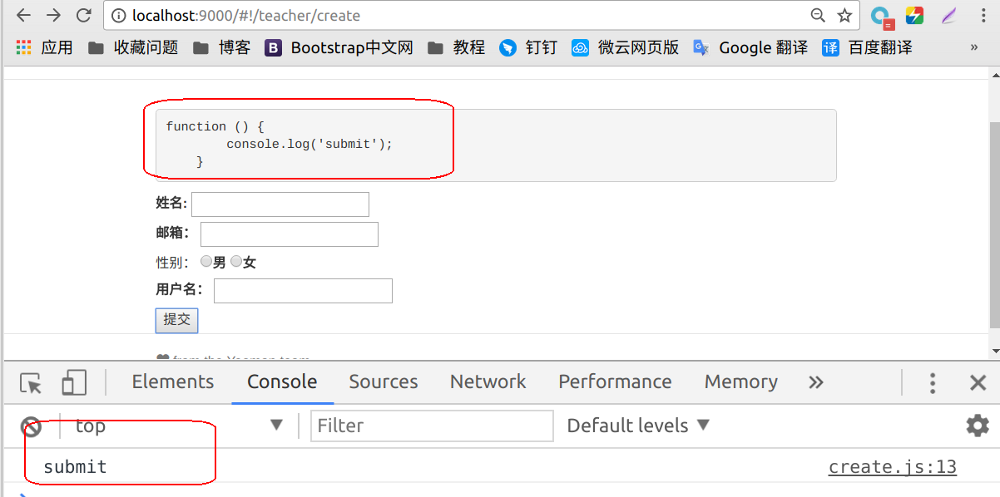

## 3.3.4前台表单模拟提交

前面我们已经写好的`c`层和`v`层，并为他们添加好了路由，在本节我们试着在`v`层点击提交按钮，触发`c`层事件来模拟提交。

为了实现`v`层与`c`层的联系，我们需要引入对象`$scope`,作为他们之间联系的桥梁，代码如下。

```javascript
angular.module('testApp')
  .controller('TeacherCreateCtrl', function($scope) {
    
  });
```

之前我们已经在`V`层写好代码，我们点击提交按钮会通过`ng-submit="submit()“`指令触发`c`层的`submit`方法，为此我们要在`c`层创建`submit`方法，并与`V`层联系起来。

首先在`c`层写入`submit`方法，如下

```javascript
angular.module('testApp')
  .controller('TeacherCreateCtrl', function($scope) {
    var submit = function() {};
  });
```

将`submit`方法与`v`层联系起来

```javascript
angular.module('testApp')
  .controller('TeacherCreateCtrl', function($scope) {
    var submit = function() {};
    $scope.submit = submit;
  });
```

为了验证当我们点击按钮后是否触发了`submit`方法，在方法中添加控制台打印数据代码如下，我们点击按钮后会在控制台上打印数据`submit`。

```javascript
angular.module('testApp')
  .controller('TeacherCreateCtrl', function($scope) {
    var submit = function() {
    	console.log('submit');
    };
    $scope.submit = submit;
  });
```

### 验证

打开前台的表单提交界面，如下图所示，会显示我们在`c`中给`$scope`绑定的`submit`属性，打开控制台，点击提交按钮，会在控制台上打印出`submit`。

 

如果你的显示界面与上图相同，表示我们的模拟提交成功。

---

作者：朱晨澍