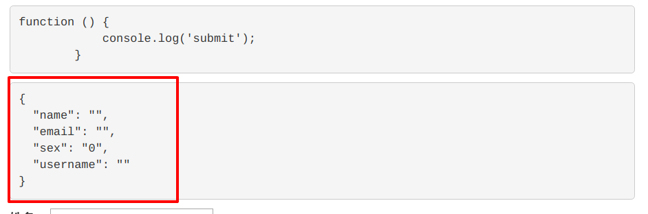
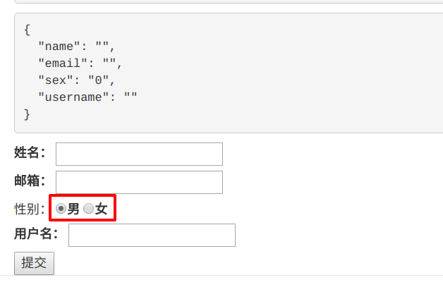

# 数据绑定

前面，我们已经了解到了Angularjs双向数据绑定的魅力，本小节我们将利用数据绑定，把我们的 `表单` 跟 `数据` 绑定起来。

## create.js

打开 `create.js` 文件，现在 `$scope` 上绑定一个变量 `data`。

```angularjs
angular.module('testApp')
    .controller('TeacherCreateCtrl', function($scope) {
        $scope.data = {};

        // 表单提交
        $scope.submit = function() {
            console.log('submit');
        };
    });
```

这里，我们将一个对象赋值给 `data`，是的，就是一个对象。它包含了表单中对应的所有变量。`$scope.data` 就和 `ThinkPHP` 中 `$this->assign()` 是一样的作用，它告诉V层你可以调用data对象中的属性。同时，它也是后面实现双向数据绑定的基础。

## 初始化data

我们先为data写一组示例数据，来模拟从数据库中读取数据。

```angularjs
angular.module('testApp')
    .controller('TeacherCreateCtrl', function($scope) {
        $scope.data = {
            name: '',
            email: '',
            sex: '0',
            username: ''
        };

        // 表单提交
        $scope.submit = function() {
            console.log('submit');
        };
    });
```

我们以json的数据格式为我们的数据对象实现初始化。

## 查看数据

打开我们的V层 `create.html`，绑定一下 `data` 对象。

```html
<form ng-submit="submit()">
    <pre>{{submit}}</pre>
    <pre>{{data | json}}</pre>
    <label>姓名：
    ...
</form>
```

然后查看一下浏览器。



## 数据绑定

初始数据已经有了，我们就可以在表单中每个 `<input>` 上绑定变量了。

```html
<form ng-submit="submit()">
    <pre>{{submit}}</pre>
    <pre>{{data | json}}</pre>
    <!--ng-model用来实现双向数据绑定-->
    <label>姓名：
        <!--data.name:data对象的name属性-->
        <input type="text" name="name" ng-model="data.name">
    </label>
    <br>
    <label>邮箱：
        <input type="email" name="email" ng-model="data.email">
    </label>
    <br> 性别：
    <label>
        <input type="radio" name="sex" value="0" ng-model="data.sex">男
    </label>
    <label>
        <input type="radio" name="sex" value="1" ng-model="data.sex">女
    </label>
    <br>
    <label>用户名：
        <input type="text" name="username" ng-model="data.username">
    </label>
    <br>
    <button>提交</button>
</form>
```

前面我们已经知道了， `ng-model` 是实现双向数据绑定的一个条件。`data.name` 这种写法表示的是 `data` 对象的 `name` 属性。所以，`ng-model="data.name"` 这句话的作用就是将data的name属性与输入框绑定。

## 测试

刷新浏览器。



可以看到 `性别` 上的圆点已经被选中，说明数据绑定成功。但是出于严谨，我们还要测试一下其他的数据绑定情况。


OK，每一个都绑定成功。

-----------------

***作者：[朴世超](www.mengyunzhi.com)***