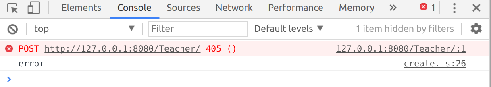
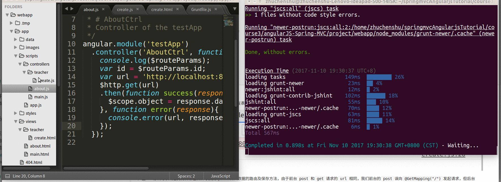
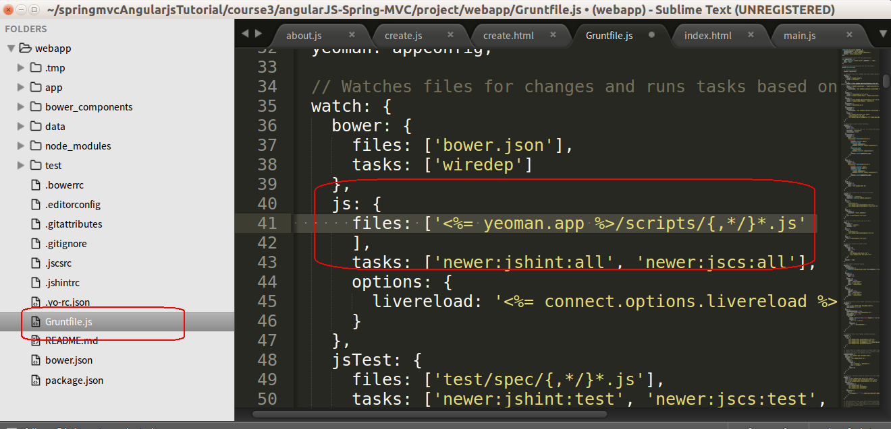

## 3.3.6发送请求

我们已经完成了前台的`c`层与`v`层，并且实现了它们之间的数据绑定，在本节中我们将试着在`c`层向后台发送数据。

在前面的章节中我们在获取后台数据时使用的是`$http`服务的`get()`方法,本节中我们要向后台发送数据，使用的方法是`$http`的`post()`方法。

接着为`c`层添加`post`方法，在写`post`方法之前，先要引入`$http`,之后还要添加`then()`来接受服务器返回的响应，查看我们的数据是否发送成功，代码如下。

```javascript
angular.module('testApp')
  .controller('TeacherCreateCtrl', function($scope, $http) {
  	$scope.data = {
  		name: '',
  		email: '',
  		sex: '0',
  		username: ''
  	};
    $scope.submit = function() {
    	console.log('submit');
        $http.post().then();
    };
  });
```

在这里我们的`post`方法包含两个参数，第一个参数是我们要请求的url路径，在这里为`http://127.0.0.1:8080/Teacher/`，第二个参数是将要发送给服务器的数据，这里为`$scope.data`,参数添加完成后代码如下

```javascript
angular.module('testApp')
  .controller('TeacherCreateCtrl', function($scope, $http) {
    $scope.data = {
      name: '',
      email: '',
      sex: '0',
      username: ''
    };

    $scope.submit = function() {
      var url = 'http://127.0.0.1:8080/Teacher/';
      $http .post(url,$scope.data).then();
    };

  });
```

为了查看我们的数据是否添加成功，我们要用`then()`接受服务器返回的信息，`then()`中有两个参数，分别是两个方法，返回成功执行第一个方法，在控制台打印`success`，返回失败执行第二个方法,在控制台打印`error`，代码如下。

```javascript
.then(function() {console.log('success');}, function() {console.log('error');});
```

整理代码格式如下：

```javascript
angular.module('testApp')
  .controller('TeacherCreateCtrl', function($scope, $http) {
    $scope.data = {
      name: '',
      email: '',
      sex: '0',
      username: ''
    };

    $scope.submit = function() {
      var url = 'http://127.0.0.1:8080/Teacher/';
      $http
        .post(url,$scope.data)
        .then(function() {
        	console.log('success');
        }, function() {
        	console.log('error');
        });
    };

  });
```

### 测试

打开前台数据发送界面同时运行后台，然后打开控制台，在表单中添加数据后点击提交，控制台会显示如下错误：

 

产生405错误的原因是我们没有在后台写接受`post`传入数据的路由及保存方法，由于前台`post`和`get`请求的`url`相同，我们前台的`post`向`@GetMapping("/")`发起请求，但后台的`GetMapping`不允许接受类型为`post`的请求。
我们在下一节中会在后台写入`post`的接受路由及保存方法。

### 添加检查

不知道你有没有发现，在前面的章节中，当我们更改`c`层代码时，我们的前台控制台上`grunt`都会为我们自动检查代码是否书写错误，如下图：

 

但在本节我们发现控制台并没有为我们自动检查代码，原因是在本框架中，默认只检查`c`层一级目录下的文件代码，但在本节中我们的代码写在`c`层的二级目录下，默认是不检查的。为此我们要更改框架代码`webapp`下的`Gruntfile.js`,在文件中ctrl+f查找如下代码

```
files: ['<%= yeoman.app %>/scripts/{,*/}*.js']
```

 

找到后将它改为如下代码，为它添加二级目录检查
```
files: ['<%= yeoman.app %>/scripts/{,*/}*.js',
          '<%= yeoman.app %>/scripts/{,*/}/{,*/}*.js'
        ]
```

然后我们更改`create.js`后，控制台上`grunt`就能为我们自动检查代码了。

---

作者：朱晨澍