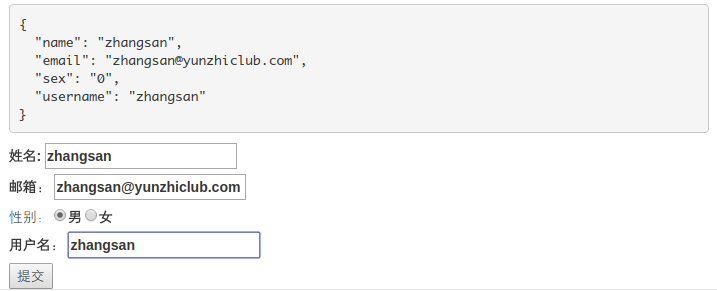
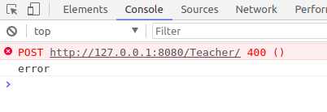
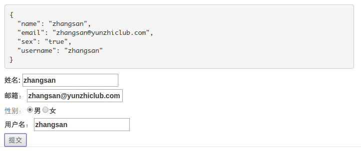
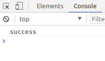
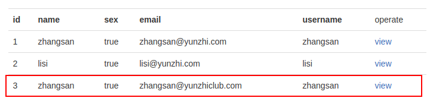

1.add method
2.add router
3.bind requestBody
4.call save()
5.test
6.debug

# 3.3.7 后台控制器

## 新建方法

上一小节中前台收到`405`错误，就是因为同一个`url`只有`@GetMapping("/")`的`getAll`方法的映射，允许`get`方法，而`post`请求未声明映射，就会被后台拒绝，返回`405`。

所以我们要新建一个`post`方法的映射。

打开后台，打开我们的`TeacherController`，再添加一个`save`方法：

```java
// 该方法只接受访问到该路由的Post请求
@PostMapping("/")
// @RequestBody绑定数据到Teacher实体上
public Teacher save(@RequestBody Teacher teacher) {
    // 调用teacherRepository中的save方法
    return teacherRepository.save(teacher);
}
```

这里的`@PostMapping("/")`声明该`url`的`post`请求映射到该方法。

## @RequestBody

这里重要的是`@RequestBody`注解，我们深入学习一下：

```json
{
    "name": "zhangsan",
    "email": "zhangsan@yunzhiclub.com",
    "sex": "0",
    "username": "zhangsan"
}
```

这是我们前台发送给后台的`Json`数据，该数据是一个具有`name`、`email`、`sex`、`username`四个属性的对象。

```java
@Entity
public class Teacher {
    @Id
    @GeneratedValue(strategy = GenerationType.AUTO)
    private Long id;

    private String name;

    private Boolean sex;

    private String email;

    private String username;
}
```

这里，前台发送的数据就和我们后台的`Teacher`实体的属性相匹配，`@RequestBody`就将传过来的`Json`数据，绑定到一个`Teacher`对象上。

## save

这里，我们用到了`teacherRepository`接口中的`save`方法。

之前我们在获取全部数据时用到了`findAll`方法，这里的`save`方法也是为我们写好的。

参数是要保存的对象，会将保存成功后的对象作为返回值返回。

## 对接

后台方法写完，运行，保证我们的代码没有错误。

```
2017-11-10 22:32:35.137  INFO 17111 --- [           main] s.b.c.e.t.TomcatEmbeddedServletContainer : Tomcat started on port(s): 8080 (http)
2017-11-10 22:32:35.141  INFO 17111 --- [           main] com.mengyunzhi.Application               : Started Application in 3.144 seconds (JVM running for 3.591)
```

启动前台，打开我们新建的页面，输入测试数据。



点击提交，但是控制台却报了`400`的错误。



出现错误，不要着急。打开`IDEA`，我们看看控制台给我们的错误信息：

```
Failed to read HTTP message: org.springframework.http.converter.HttpMessageNotReadableException: JSON parse error: Can not deserialize value of type java.lang.Boolean from String "0": only "true" or "false" recognized; nested exception is com.fasterxml.jackson.databind.exc.InvalidFormatException: Can not deserialize value of type java.lang.Boolean from String "0": only "true" or "false" recognized
 at [Source: java.io.PushbackInputStream@d845505; line: 1, column: 60] (through reference chain: com.mengyunzhi.repository.Teacher["sex"])
```

无法读取`HTTP`信息，`Json`解析失败，无法将`String "0"`反序列化为`Boolean`类型，只有`true`或`false`才能被识别。

> 我们把对象转化为字节序列的过程称为序列化，把字节序列恢复为对象的过程称为反序列化。

这里我们前台传过去的`0`和`1`不能像我们之前`ThinkPHP`一样自动转换，所以我们将其改为`true`和`false`。

## 修改

我们将男女单选框的`value`由`0`与`1`改为`true`和`false`。

```html
<input type="radio" name="sex" value="true" ng-model="data.sex">男
<input type="radio" name="sex" value="false" ng-model="data.sex">女
```

`teacher/create.js`中的初始化数据也修改为`true`。

```javascript
$scope.data = {
    name: '',
    email: '',
    sex: 'true',
    username: ''
};
```

填写测试数据。



控制台打印`success`，成功！



最后，我们点击首页，我们看到多了一条数据。



*作者：张喜硕*