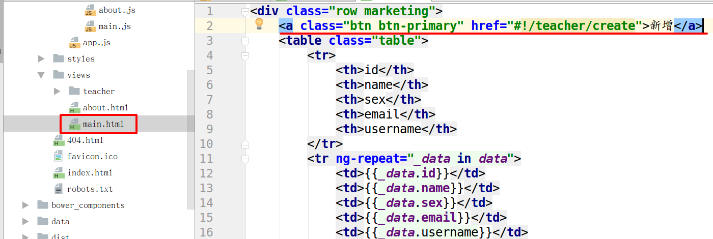
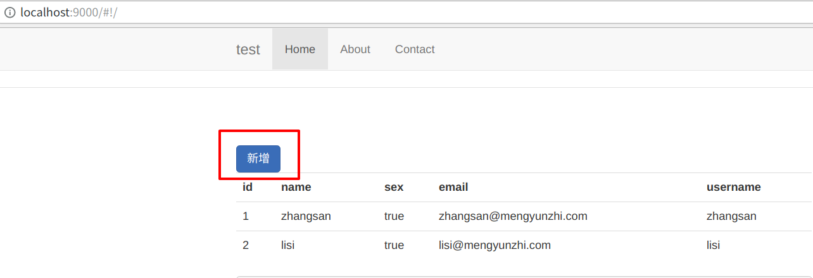
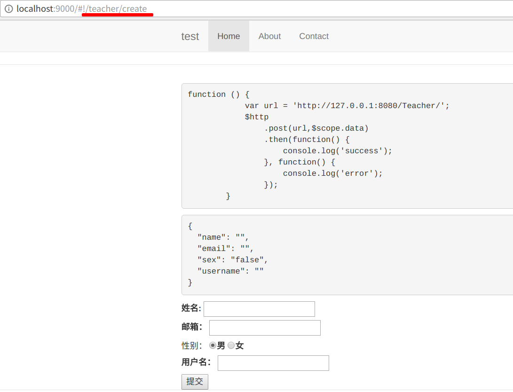
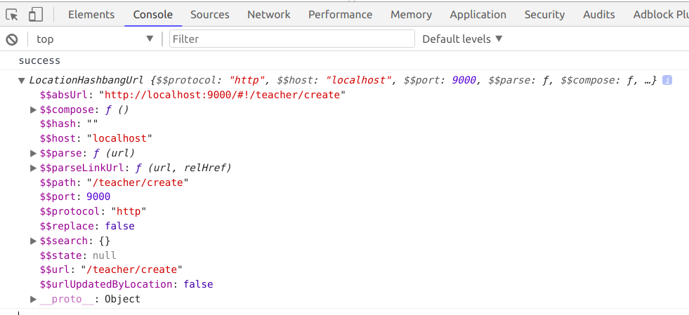
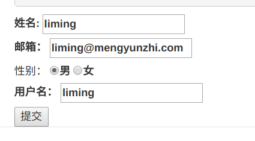
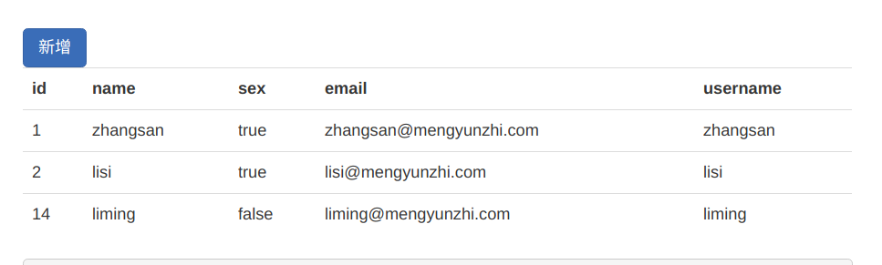

1.link index to add
2.link add to index
3.remove debug information

# 页面跳转

我们的新增页面已经做好了，接下来就是将新增界面与前面做展示数据的页面串起来，通过点击按钮实现页面间的跳转。

## 展示到新增

打开**main.html**,在里面添加一个按钮，用来实现从所有人信息页面跳转到新增界面。


```html
<a class="btn btn-primary" href="#!/teacher/create">新增</a>
```



我们用了一个 `<a></a>` 标签，然后添加新增界面的地址。打开浏览器。



左上角多了一个 `新增` 按钮。点击一下按钮。



ok，跳转成功！

## 保存成功跳转

添加成功后，我们需要在点击***提交***时跳转回原来的界面。

由于在点击提交时，会触发 `submit()` 函数，所以，我们需要在 `controller` 中的 `submit` 函数中实现跳转。

打开 `create.js`。这里我们需要用到`$location`来帮助我们实现跳转。注入一下。

```angularjs
...
angular.module('testApp')
    .controller('TeacherCreateCtrl', function($scope, $http, $location) {
        $scope.data = {
            name: '',
            email: '',
            sex: 'false',
            username: ''
        };
        ...
```

`$location` 和 `$scope`还有`$http`一样，都是Angualrjs为我们封装好的对象，我们只需要在用的时候注入一下。打印一下$location。

```angularjs
...
$scope.submit = function() {
            var url = 'http://127.0.0.1:8080/Teacher/';
            $http
                .post(url,$scope.data)
                .then(function() {
                    console.log('success');
                    console.log($location);
                }, function() {
                    console.log('error');
                });
        };
...
```

点击**提交**,打开控制台。



可以看到 `$location` 这个对象上绑定了协议，主机，端口号，方法等信息。当然，它还绑定了很多方法。下面我们用它的`path()`方法来实现改变url。

```angularjs
...
$scope.submit = function() {
            var url = 'http://127.0.0.1:8080/Teacher/';
            $http
                .post(url,$scope.data)
                .then(function() {
                    console.log('success');
                    console.log($location);
                    $location.path('/');
                }, function() {
                    console.log('error');
                });
        };
...
```

测试一下。将表单信息填写完，点击提交。





跳转成功，数据也成功保存。

## 去除Debug信息

前面我们写了好多帮助我们理解代码执行过程的代码，现在我们将它们都去掉。最终代码如下：

**create.html**

```html
<form ng-submit="submit()">
    <label>姓名:
        <input type="text" name="name" ng-model="data.name"/>
    </label>
    <br>
    <label>邮箱：
        <input type="email" name="email" ng-model="data.email">
    </label>
    <br> 性别：
    <label>
        <input type="radio" name="sex" value="false" ng-model="data.sex">男</label>
    <label>
        <input type="radio" name="sex" value="true" ng-model="data.sex">女</label>
    <br>
    <label>用户名：
        <input type="text" name="username" ng-model="data.username">
    </label>
    <br>
    <button>提交</button>
</form>
```

**create.js**

```angularjs
'use strict';

/**
 * @ngdoc function
 * @name testApp.controller:TeacherCreateCtrl
 * @description
 * # TeacherCreateCtrl
 * Controller of the testApp
 */
angular.module('testApp')
    .controller('TeacherCreateCtrl', function($scope, $http, $location) {
        $scope.data = {
            name: '',
            email: '',
            sex: 'false',
            username: ''
        };

        $scope.submit = function() {
            var url = 'http://127.0.0.1:8080/Teacher/';
            $http
                .post(url,$scope.data)
                .then(function() {
                    console.log('success');
                    $location.path('/');
                }, function() {
                    console.log('error');
                });
        };

    });
```

到此为止，新增就全部写完了。

-------------

**官方参考资料：**[https://docs.angularjs.org/api/ng/service/$location](https://docs.angularjs.org/api/ng/service/$location)

***作者：[朴世超](www.mengyunzhi.com)***