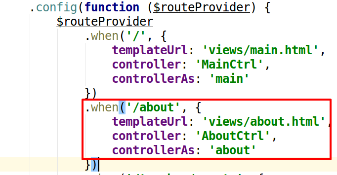
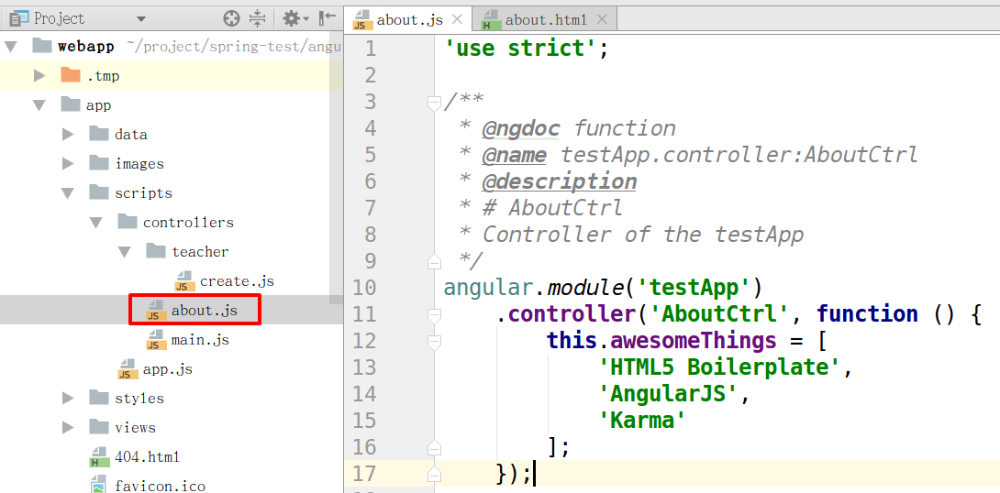
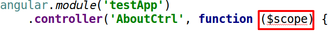
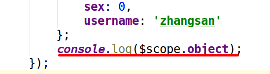
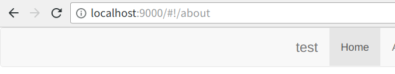
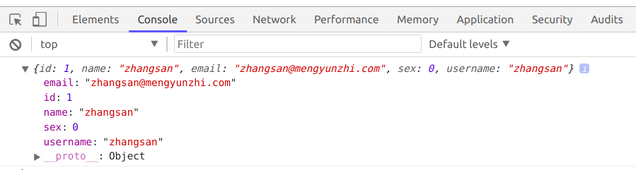

# 前台控制器

还是同样的步骤，建完前台视图层，然后建立前台C层。本节将实现前台控制器的初始化。

## 路由对应

有了上一章的例子，我们应该知道了，每写一个文件时，都要让它和别的部分连起来。而C层控制器和V层是在 `app.js` 的路由表中连接起来的。



这是已经写好的路由表。从这里我们可以看到，和我们刚刚建立的V层相关联的C层控制器是 `AboutCtrl`，也就是 `about.js` 文件。

## 前台控制器初始化

打开about.js文件。



去除原来内容，注入 `$scope` 。

```angularjs
angular.module('testApp')
    .controller('AboutCtrl', function ($scope) {

    });
```



写一组测试用例。

```angularjs
angular.module('testApp')
    .controller('AboutCtrl', function ($scope) {
        $scope.object = {
            id: 1,
            name: 'zhangsan',
            email: 'zhangsan@mengyunzhi.com',
            sex: 0,
            username: 'zhangsan'
        };
    });
```

## 测试

每次写完几行代码我们都要想着测试。

```angularjs
    ...
    console.log($scope.object);
    ...
```



打开浏览器，右键打开控制台。





看到如上信息说明我们的测试用例写成功了。

最后，去除 `console.log()`。

### 查看实例代码

```bash
git checkout -f 3.4.3-webapp-controller
```

-----------

***作者：[朴世超](www.mengyunzhi.com)***