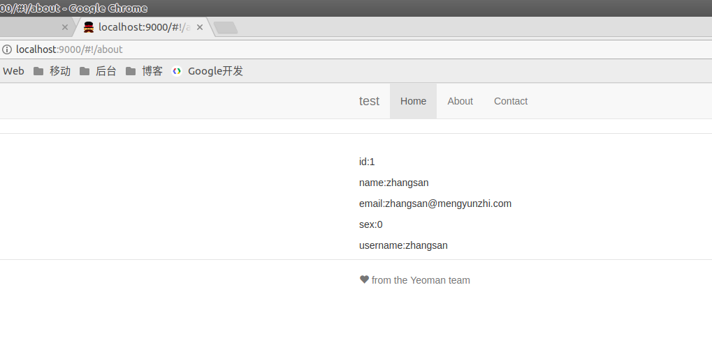

# 3.4.2 前台视图

上一小节中，我们已经设定了路由，本节，我们来初始化视图层。

```javascript
.config(function ($routeProvider) {
    $routeProvider
        .when('/', {
            templateUrl: 'views/main.html',
            controller: 'MainCtrl',
            controllerAs: 'main'
        })
        .when('/about', {
            templateUrl: 'views/about.html',
            controller: 'AboutCtrl',
            controllerAs: 'about'
        })
        .otherwise({
            redirectTo: '/'
        });
});
```

# about.html

路由中定义的路径是`views/about.html`，我们找到这个文件。

其内容修改为如下代码：

```html
<p>id:1</p>
<p>name:zhangsan</p>
<p>email:zhangsan@mengyunzhi.com</p>
<p>sex:0</p>
<p>username:zhangsan</p>
```

打开浏览器，访问路由[http://localhost:9000/#!/about](http://localhost:9000/#!/about)



视图层初始化完成，是不是很简单呢？

*作者：张喜硕*