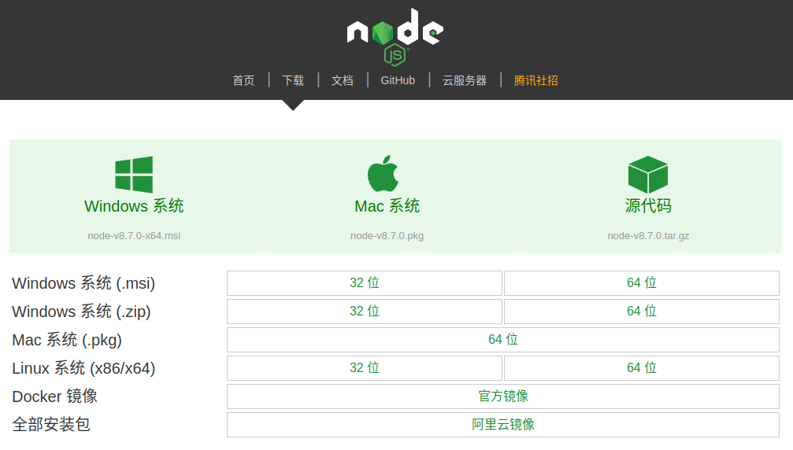
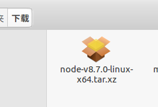
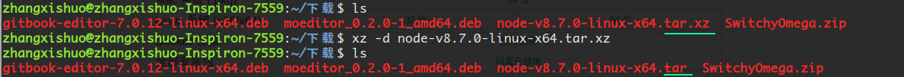
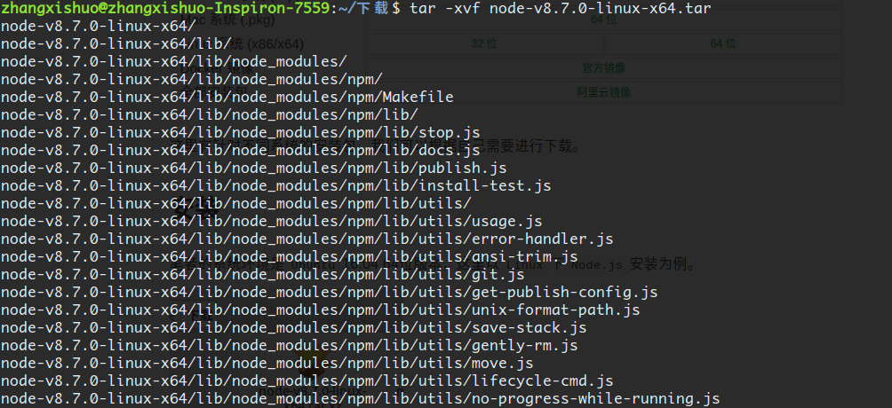
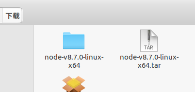
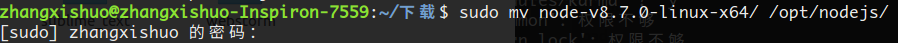
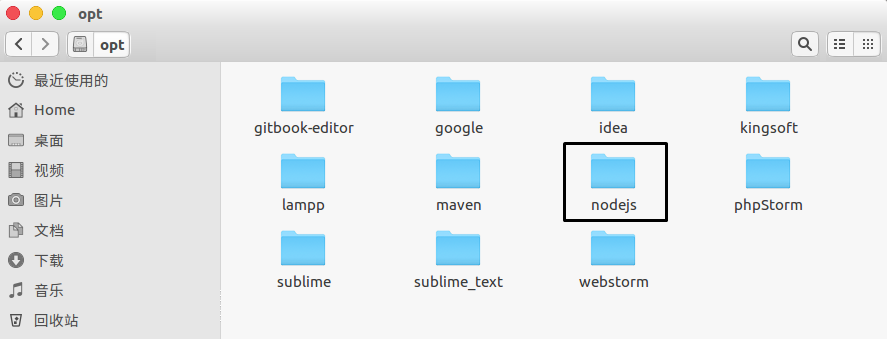
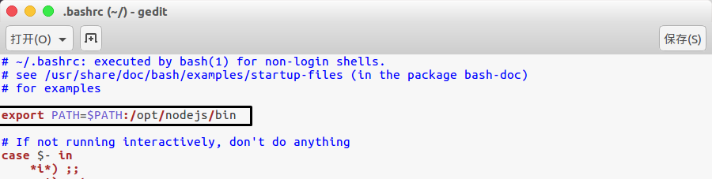
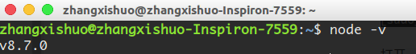

# 第一节 Node.js
`Node.js` 是一个基于 `Chrome V8` 引擎的 `JavaScript` 运行环境。 `Node.js` 的包管理器 `npm`，是全球最大的开源库生态系统。

`npm`中有许多优秀的软件包，可以简化我们的开发。

## 下载

这是`Node.js`中文官网的下载地址，[node.js下载地址](http://nodejs.cn/download/ "node.js下载地址")

当然，如果你习惯英文版，也可以去英文官网下载，[node.js英文官网下载地址](https://nodejs.org/en/download/ "node.js英文官网下载地址")

这里我们以中文官网为例：

这里有针对不同系统的安装包，我们可以根据自己需要进行下载。

## 解压

笔者的系统环境是`Ubuntu`16.04 64位版本，这里以`Linux`下`Node.js`安装为例。

下载完成后，打开终端，进入该文件夹。

这是`xz`类型的文件包，执行命令`xz -d node-v8.7.0-linux-x64.tar.xz`

文件类型由`.tar.xz`变成了`.tar`，我们再对`tar`文件进行操作，执行命令`tar -xvf node-v8.7.0-linux-x64.tar`。

这里会执行包解压操作，会在终端中打印许多信息，我们等到该命令执行完成，再打开下载目录，会发现已经生成了我们需要的文件夹。

## 移动

我建议把`Node.js`软件放进`/opt`目录，当然如果不喜欢的话，可以跳过这步。只要环境变量配置正确，在任意目录都是可以用的。

`sudo mv node-v8.7.0-linux-x64/ /opt/nodejs/`

打开`/opt`文件夹，已经将`Node.js`移动过来了。

## 环境变量

编辑配置文件，`gedit ~/.bashrc`，在文件开头处添加`export PATH=$PATH:/opt/nodejs/bin`，来导入我们的路径变量。

注：网上有些教程推荐将路径导入文件结尾处，经测试后发现虽然也能生效，但是会导致系统无法关机。

保存，关闭。`source ~/.bashrc`，让该文件生效。

新建一个终端，执行命令`node -v`，输出当前安装的`Node.js`版本号，即证明安装成功。

## 注意

这些步骤中最容易出错的就是环境变量的配置，如果安装失败，去检查一下导入的路径是否正确，且是否已经让`.bashrc`文件生效。

*作者：张喜硕*