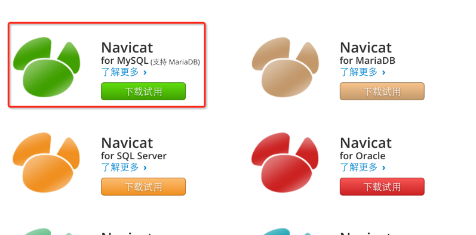

## 第三节：NAVICAT
Navicat是香港卓软数码科技有限公司生产的一系列MySQL、MariaDB、Oracle、SQLite、PostgreSQL 及Microsoft SQL Server图形化资料库管理及发展软件。

*** windows上安装**

Navicat官方下载地址：
[https://www.navicat.com.cn/download](https://www.navicat.com.cn/download) 
推荐下载如下图中红框标识的版本：
 

***ubuntu上安装**

Navicat官方下载地址：
[https://www.navicat.com/en/products](https://www.navicat.com/en/products) 
下载上图所示版本
1. 下载 navicat110_mysql_en.tar.gz 文件 
2. 下载后解压tar文件
`tar -zxvf  /home/rain/download/navicat8_mysql_en.tar.gz`
3. 解压后  进入解压后的目录运行命令：
`./start_navicat`
OK，这样就完啦
如果使用不顺手，可以选择在ubuntu商店上下载Mysql Workbrench 
