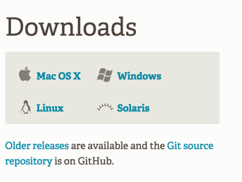
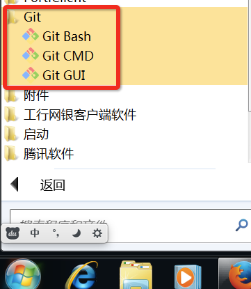
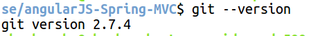

##第三节：GIT
**1 .windows上安装
**
git客户端下载地址为：
[https://git-scm.com/downloads](https://git-scm.com/downloads) 
 
在安装过程中，全部选择默认设置，即直接一步步点击【Next】按钮，直至完成安装。

安装完成后，你将在【开始】-【所有程序】中，找到Git为我们安装的三个软件。如下图所示：
 

**2 .ubuntu上安装
**
官网上提供的命令是：
'sudo add-apt-repository ppa:git-core/ppa'
中间暂停时，按回车键Enter继续安装。
'sudo apt-get update'
'sudo apt-get install git '
安装下载完成后，可以使用下面的命令行，确认git的版本：
'git --version '
 