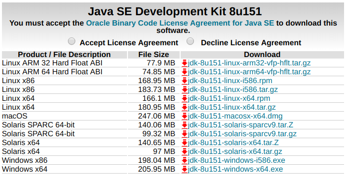
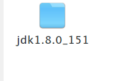
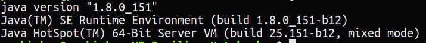
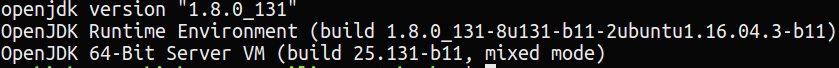
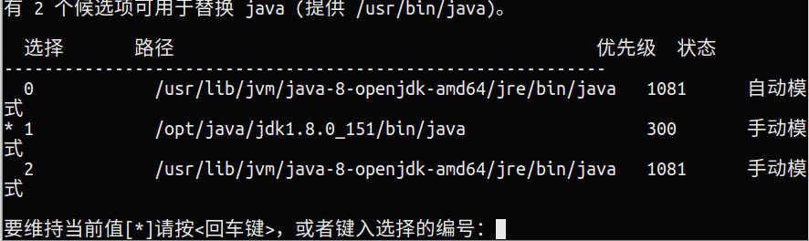

# 第五节 JDK的安装

` JDK(Java Development Kit)` 是 `太阳微系统 `针对 `Java` 开发人员发布的 `免费软件开发工具包`（SDK，Software development kit）。自从Java推出以来，JDK已经成为使用最广泛的Java SDK。

我这里使用的系统是Ubuntu 16.04。

## 下载
这里给出jdk的[官方网站](http://www.oracle.com/technetwork/java/javase/downloads/jdk8-downloads-2133151.html),



选择 `Accept License Agreement`， 然后选择对应自己电脑的版本进行下载，我这里下载的是 `jdk-8u151-linux-x64.tar.gz`。

## 解压

进入你文件下载的位置，进行解压。

```bash
$ tar -zxvf jdk-8u151-linux-x64.tar.gz
```


然后创建一个新的目录用来存放jdk文件。我习惯将文件保存在 `/opt` 目录下，你也可以选择其他位置存放。但一定要记好 `存放位置` ，后面会有用。

```bash
$ sudo mkdir /opt/java
```

将解压后的文件移动到创建的目录中。

```bash
$ sudo mv jdk1.8.0_151/ /opt/java
```

## 环境配置

先修改 `/etc/environment` 文件。

```bash
$ sudo gedit /etc/environment
```

然后在里面加上下面这段内容

> PATH="/usr/local/sbin:/usr/local/bin:/usr/sbin:/usr/bin:/sbin:/bin:/usr/games:/usr/local/games:$JAVA_HOME/bin"
  export CLASSPATH=.:$JAVA_HOME/lib:$JAVA_HOME/jre/lib
  export JAVA_HOME=/opt/java/jdk1.8.0_151

`JAVA_HOME` 改成你自己的jdk的路径。

保存，关闭。然后让文件生效。

```bash
$ source /etc/enviroment
```

这只完成了 `第一步`，到这里的配置只能当前生效，电脑重启后就会失效。接下来我们继续配置 `/etc/profile` 文件。

```bash
$ sudo gedit /etc/profile
```

在文件的最后面加上下面的配置信息。

`#set Java environment
 export JAVA_HOME=/opt/java/jdk1.8.0_151
 export JRE_HOME=$JAVA_HOME/jre
 export CLASSPATH=.:$JAVA_HOME/lib:$JRE_HOME/lib:$CLASSPATH
 export PATH=$JAVA_HOME/bin:$JRE_HOME/bin:$PATH`

同样的，`JAVA_HOME` 中也要替换成你自己的路径。

保存，关闭。然后让文件生效。

```bash
$ source /etc/profile
```

测试一下，是否配置成功。

```bash
$ java -version
```

`注意：` 你的 `版本信息` 是否与你安装的jdk版本一致。



如果，你的版本信息和你刚才下载一致，恭喜你 `配置成功`，你可以跳过下面的步骤。



如果，你的版本信息如上，那么你需要修改一下你的默认jdk。

## 修改默认JDK

我们刚才下载的是Oracle的JDK，而电脑自带的是OpenJDK。这是两家不同的公司出版的JDK。

依次执行下面的命令：

```bash
$ udo update-alternatives --install /usr/bin/java java /opt/java/jdk1.8.0_151/bin/java 300 
$ sudo update-alternatives --install /usr/bin/javac javac /opt/java/jdk1.8.0_151/bin/javac 300 
$ sudo update-alternatives --config java
```
`/opt/java/jdk1.8.0_151` 的位置替换成你自己的文件路径。



这里系统会会列出所有的JDK，选择自己刚下载版本对应的数字，回车。

然后在执行命令：

```bash
$ java -version
```


到此为止，jdk就已经配置好了。