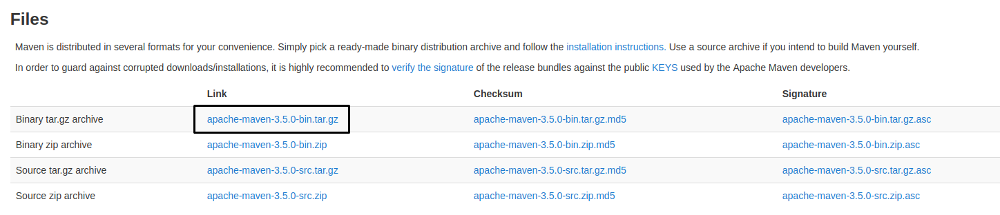
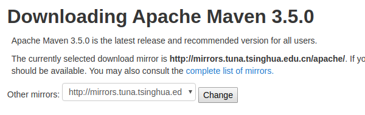
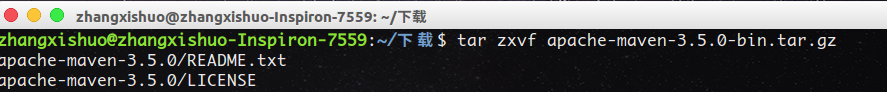
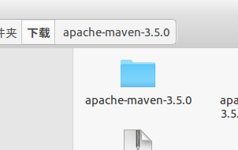
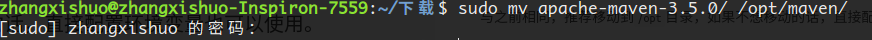
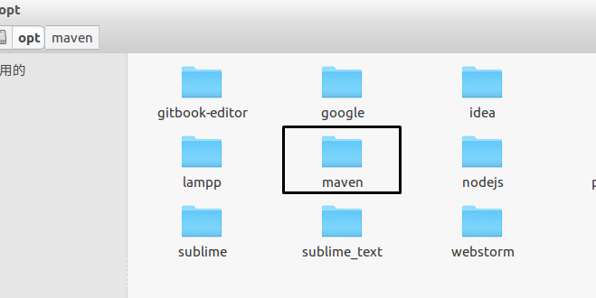
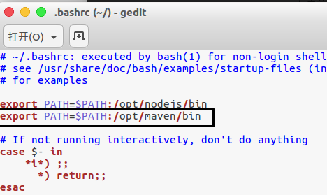
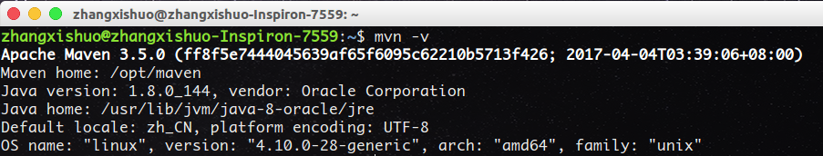

# 第六节 maven

`maven`是一个软件项目管理工具。

因为我们的后台是用`Java`编写的，我们需要用到很多第三方的`jar`包，如果手动管理会耗费大量的精力，而`maven`这款小工具正好解决了我们的问题。

## 下载

这是`maven`的官方下载地址：[maven下载地址](http://maven.apache.org/download.cgi)



我们下载第一个，`apache-maven-3.5.0-bin.tar.gz`。



在网页上方可以选择下载源，如果下载失败的话，可以尝试更换源后进行下载。

## 解压

打开终端，进入相应下载路径，执行命令

```
tar zxvf apache-maven-3.5.0-bin.tar.gz
```



生成相应文件夹，解压成功！



## 移动

与之前相同，推荐移动到`/opt`目录，如果不想移动的话，直接配置环境变量也可以使用。

```
sudo mv apache-maven-3.5.0/ /opt/maven/
```



打开`/opt`目录，看到`maven`，移动成功。



## 环境变量

编辑配置文件

```
gedit ~/.bashrc
```

在原有基础上再添加一行，导入`maven`路径。

```
export PATH=$PATH:/opt/maven/bin
```



保存，关闭，并让该文件生效。

```
source ~/.bashrc
```

新建一个终端，执行命令`mvn -v`，输出当前安装的`maven`版本号，即证明安装成功。



*作者：张喜硕*