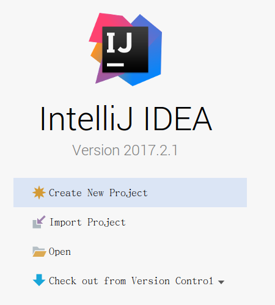

## 第三节：idea

**ubuntu上安装**

官网下载地址：

[https://www.jetbrains.com/idea/download/#section=linux](https://www.jetbrains.com/idea/download/#section=linux) 

下载ultimate版本

 

下载完成进入下载位置 解压 到 /opt下

`sudo tar -zxvf ideaIU-2017.2.1.tar.gz -C /opt/`

dea.sh是IDEA的启动文件 我们运行它 启动 IDEA 

`sudo /opt/idea-IU-172.3544.35/bin/./idea.sh`

 

---

作者：朱晨澍
